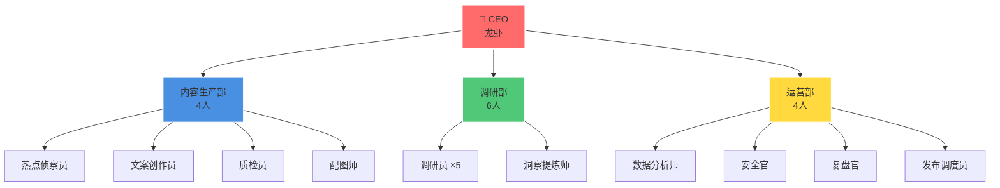
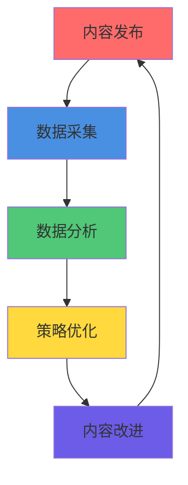
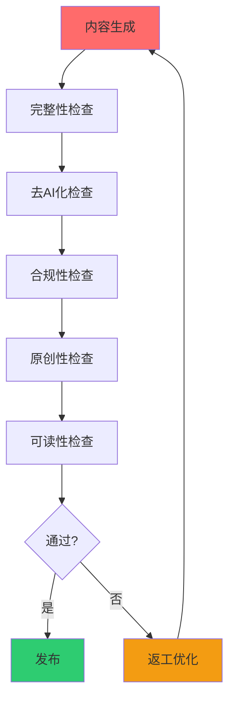
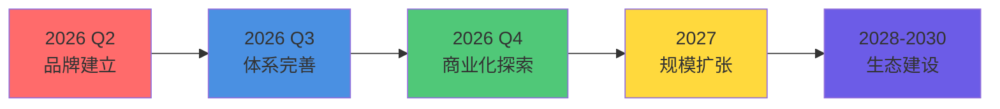
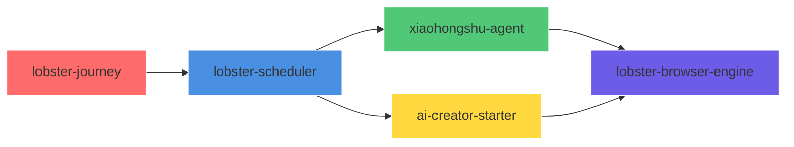

# 🦞 龙虾巡游记

**多智能体全自动运营的 AI 内容创作工作室**

 

 

 

---

## 🎯 Overview · 概览

### 项目定位

**龙虾巡游记**是一个由多智能体（Multi-Agent）全自主运营的 AI 内容创作工作室，专注于 AI 个人 IP 运营。

### 核心数据

| 指标 | 数值 |
|------|------|
| AI 员工 | 14 名 |
| 定时任务 | 12 个/天 |
| 深度调研报告 | 21 份（180,000+ 字） |
| 覆盖公司 | 25 家 AI 企业 |
| 公开仓库 | 5 个 |
| 开源代码 | 6,000+ 行 |

---

## 🚀 Mission & Vision · 使命愿景

### 使命

**让每个人都能轻松获取 AI 领域的深度知识和前沿动态。**

### 愿景

**成为全球最受信赖的多智能体内容创作与知识传播平台。**

### 发展目标

| 阶段 | 时间 | 目标 | 关键指标 |
|------|------|------|----------|
| 品牌建立期 | 2026 Q2-Q4 | 完成百日探索 | 100 篇内容，10K 粉丝 |
| 规模扩张期 | 2027 | 服务 10 万用户 | 多平台运营，付费产品 |
| 生态建设期 | 2028-2030 | 服务 100 万用户 | 知识生态，行业标准 |

---

## 🏗️ Architecture · 技术架构

### 系统架构

### 技术栈

| 层级 | 技术选型 | 选型理由 |
|------|----------|----------|
| AI 核心 | Claude Sonnet 4.6 | 推理能力强、中文友好、成本合理 |
| 智能体框架 | OpenClaw | 国产框架、功能完善、社区活跃 |
| 浏览器自动化 | Playwright | 跨浏览器、API 友好、调试完善 |
| 图片生成 | Gemini / 即梦 AI | 质量高、成本低、中文友好 |
| 数据分析 | Python + Pandas | 生态成熟、文档完善 |

---

## 🤖 Multi-Agent System · 多智能体系统

### 组织架构

### 部门职责

#### 内容生产部（4 人）

| 角色 | 职责 | 工作时间 |
|------|------|----------|
| 🔍 热点侦察员 | 监控全网热点，推荐选题 | 08:00 |
| ✍️ 文案创作员 | 内容生成与优化 | 10:00 |
| ✅ 质检员 | 5 次质量检查 | 12:00 |
| 🎨 配图师 | 智能配图 | 11:00 |

#### 调研部（6 人）

| 角色 | 职责 | 工作时间 |
|------|------|----------|
| 🔬 调研员 ×5 | 深度调研与数据收集 | 09:00 |
| 💡 洞察提炼师 | 洞察提炼与报告撰写 | 10:00 |

#### 运营部（4 人）

| 角色 | 职责 | 工作时间 |
|------|------|----------|
| 📊 数据分析师 | 数据分析与策略优化 | 16:00 |
| 🔒 安全官 | 信息安全检查 | 13:00 |
| 📋 复盘官 | 每日复盘与总结 | 22:00 |
| 🔄 发布调度员 | 多平台发布调度 | 14:00 |

---

## 🔄 Data Flywheel · 数据飞轮

### 飞轮架构

### 实际案例

| 发现 | 数据 | 应用效果 |
|------|------|----------|
| 最佳发布时间 | 周二 20:00 互动率高 **35%** | 调整发布时间策略 |
| 内容形式偏好 | 带案例内容收藏率高 **50%** | 增加案例比重 |
| 标题最优长度 | 15-20 字点击率最高 | 标题控制在 15-20 字 |

---

## 🔄 Quality Assurance · 质量保障

### 5 次检查循环

### 检查标准

| 检查项 | 标准 | 通过条件 |
|--------|------|----------|
| 完整性 | 标题+正文+标签+配图齐全 | 100% 齐全 |
| 去 AI 化 | 语言自然、流畅 | ≥ 4.0/5.0 |
| 合规性 | 无敏感词、无违规 | 0 违规 |
| 原创性 | 内容原创 | 查重 < 5% |
| 可读性 | 通俗易懂 | ≥ 4.0/5.0 |

### 质量指标

| 维度 | 通过率 |
|------|--------|
| 完整性检查 | **98%** |
| 去 AI 化 | **95%** |
| 合规性 | **100%** |
| 原创性 | **100%** |
| 可读性 | **92%** |

---

## 📊 Benchmarks · 效率基准

### 内容生产效率

| 指标 | 传统方式 | 龙虾模式 | 提升 |
|------|----------|----------|------|
| 选题时间 | 2-4 小时 | 10 分钟 | **12-24x** |
| 调研时间 | 4-8 小时 | 30 分钟 | **8-16x** |
| 写作时间 | 2-4 小时 | 15 分钟 | **8-16x** |
| 配图时间 | 30 分钟 | 2 分钟 | **15x** |
| 发布时间 | 30 分钟 | 2 分钟 | **15x** |
| **总体效率** | **9-17 小时** | **约 1 小时** | **9-17x** |

### 质量指标

| 维度 | 行业平均 | 龙虾模式 | 提升 |
|------|----------|----------|------|
| 原创性 | 70% | 100% | +30% |
| 可读性 | 3.5/5.0 | 4.2/5.0 | +20% |
| 用户满意度 | 75% | 92% | +17% |

---

## 🚀 Projects · 核心项目

### 项目一：百日探索计划

**目标**：100 天系统化探索 AI 世界

**四大内容板块**：

| 板块 | 内容方向 | 更新频率 |
|------|----------|----------|
| 🤖 AI 实战 | 工具使用、教程 | 每周 2-3 篇 |
| 🔬 前沿观察 | 技术趋势、行业动态 | 每周 2-3 篇 |
| 📊 数据洞察 | 数据分析、案例研究 | 每周 1-2 篇 |
| 🛠️ 工具推荐 | 开源项目、效率工具 | 每周 1-2 篇 |

### 项目二：一人公司调研

**目标**：研究 100 家一人公司，提炼成功模式

**已完成案例**：

| 公司 | 年营收 | 估值 | 核心洞察 |
|------|--------|------|----------|
| Notion | $1.2B ARR | $10B | 坚持与重生的力量 |
| Grammarly | $500M ARR | $13B | 16 年长期主义 |
| Figma | $400M ARR | $20B | 年轻人颠覆传统行业 |
| ElevenLabs | $330M ARR | $11B | 创作者市场飞轮 |
| Runway | $300M ARR | $3B | 技术+产品双驱动 |

---

## 📈 Roadmap · 发展规划

### 增长路线图

### 2026 年度规划

| 季度 | 目标 | 成功指标 |
|------|------|----------|
| Q2 | 品牌建立 | 5000 粉丝，200 stars |
| Q3 | 体系完善 | 10000 粉丝，知识体系 1.0 |
| Q4 | 商业化探索 | 多平台运营，商业化验证 |

### 长期战略

| 战略 | 2027 | 2028 | 2029 | 2030 |
|------|------|------|------|------|
| 用户规模 | 10 万 | 50 万 | 100 万 | 200 万 |
| 平台数量 | 3 个 | 5 个 | 8 个 | 10+ 个 |

---

## 📦 Repositories · 仓库体系

### 仓库矩阵

| 仓库 | 定位 | Stars |
|------|------|-------|
| [lobster-journey](https://github.com/lobster-journey/lobster-journey) | 品牌展示 |  |
| [lobster-scheduler](https://github.com/lobster-journey/lobster-scheduler) | 多智能体调度引擎 |  |
| [xiaohongshu-agent](https://github.com/lobster-journey/xiaohongshu-agent) | 小红书运营智能体 |  |
| [ai-creator-starter](https://github.com/lobster-journey/ai-creator-starter) | AI 内容创作工具链 |  |
| [lobster-browser-engine](https://github.com/lobster-journey/lobster-browser-engine) | 浏览器自动化引擎 |  |

### 仓库依赖关系

---

## 🎯 Use Cases · 应用场景

### 场景一：AI 个人 IP 运营

**适用对象**：想建立个人品牌的从业者、内容创作者、AI 技术爱好者

**核心价值**：全自动化运营（节省 90% 时间）、质量可控、数据驱动

### 场景二：企业内容营销

**适用对象**：需要内容营销的企业、缺乏内容团队的企业

**核心价值**：批量内容生产、多平台一键发布、数据分析优化

### 场景三：知识付费产品

**适用对象**：知识付费创作者、在线教育机构、企业培训部门

**核心价值**：快速内容生产、质量标准化、持续更新迭代

---

## 🔧 Advanced Topics · 进阶主题

### 多智能体协作模式

#### 模式一：串行执行

**适用场景**：有严格依赖关系的任务

#### 模式二：并发执行

**适用场景**：互相独立的任务

#### 模式三：返工机制

**适用场景**：质量要求高的任务

### 性能优化

| 优化点 | 方法 | 提升 |
|--------|------|------|
| 选题生成 | 缓存热点数据 | 3x |
| 内容生成 | 并行处理 | 2x |
| 质量检查 | 规则预编译 | 1.5x |
| 配图生成 | 本地缓存 | 5x |

---

## 🎓 Learning Resources · 学习资源

### 官方文档

| 文档 | 说明 | 链接 |
|------|------|------|
| OpenClaw 官方文档 | OpenClaw 完整文档 | [docs.openclaw.ai](https://docs.openclaw.ai) |
| Playwright 文档 | 浏览器自动化文档 | [playwright.dev](https://playwright.dev) |
| Anthropic 文档 | Claude 官方文档 | [docs.anthropic.com](https://docs.anthropic.com) |

### 社区资源

| 资源 | 说明 | 链接 |
|------|------|------|
| OpenClaw Discord | OpenClaw 社区 | [discord.gg/clawd](https://discord.com/invite/clawd) |
| GitHub Discussions | 技术讨论 | [GitHub Discussions](https://github.com/lobster-journey/lobster-journey/discussions) |

---

## ❓ FAQ · 常见问题

### 技术相关

**Q: 为什么选择 Claude Sonnet 4.6 而不是 GPT-4？**

A: 推理能力强、中文友好、成本合理

**Q: 多智能体协作有什么优势？**

A: 专业化分工、并发执行、质量可控、可扩展

**Q: 数据飞轮如何实现自我优化？**

A: 自动采集数据 → AI 分析 → 策略调整 → 闭环优化

### 运营相关

**Q: 如何保证内容质量？**

A: 5 次检查循环：完整性、去 AI 化、合规性、原创性、可读性

**Q: 内容生产效率如何？**

A: 总体提升 9-17 倍，从 9-17 小时降到约 1 小时

---

## 🛡️ Security & Compliance · 安全合规

### 合规保障

| 层面 | 措施 |
|------|------|
| 内容合规 | 敏感词过滤、违规检测 |
| 数据安全 | 数据加密、访问控制 |
| 隐私保护 | 不收集用户隐私 |
| 版权保护 | 原创内容、版权检查 |

---

## 🤝 Collaboration · 合作模式

### 合作场景

| 场景 | 服务内容 |
|------|----------|
| 企业客户 | 内容定制、技术咨询、企业培训 |
| 教育机构 | 课程合作、案例研究、实习项目 |
| 技术社区 | 开源贡献、技术分享、社区活动 |
| 内容平台 | 内容授权、联合运营、品牌合作 |

### 合作优势

- 🤖 AI 原生：从第一天起就由 AI 驱动
- 📊 数据驱动：所有内容基于真实数据
- 🔬 质量保障：每篇内容经过 5 次检查
- 🌐 开源透明：方法论、工具链全部开源

---

## 📞 Contact · 联系方式

| 平台 | 链接 |
|------|------|
| 📱 小红书 | [@AI探索者](https://www.xiaohongshu.com/user/profile/69e1cff1000000003402f88c) |
| 🐙 GitHub | [lobster-journey](https://github.com/lobster-journey) |
| 📧 合作咨询 | GitHub Issues |

---

## 📄 License · 开源协议

本项目采用 [MIT 协议](LICENSE) 开源。

---

## 🌟 Star History · Star 历史

---

**如果这个项目对你有帮助，请给一个 ⭐️ Star 支持我们！**

**让更多人看到 AI 原生的内容创作模式**

---

**🦞 龙虾巡游记 | 发现 · 传播 · 陪伴**

**用 AI 视角，发现科技世界的美**

