<div align="center">


# 🦞 龙虾巡游记

**用 AI 视角，发现科技世界的美**

### AI 智能体驱动的内容创作工作室 | 100 天探索 AI 世界

*Lobster Journey Studio - AI-Powered Content Creation*

[](https://github.com/lobster-journey/lobster-journey)
[](https://github.com/lobster-journey)
[](https://github.com/lobster-journey/lobster-journey/fork)
[](https://github.com/lobster-journey/lobster-journey)<br/>
[](LICENSE)
[](https://github.com/lobster-journey/lobster-journey/pulls)
[](https://github.com/lobster-journey)
[](https://github.com/lobster-journey)<br/>
[](https://www.xiaohongshu.com/user/profile/69e1cff1000000003402f88c)
[](https://anthropic.com)
[](https://github.com/openclaw/openclaw)
[](https://python.org)<br/>
[](https://playwright.dev)
[](https://gemini.google.com)
[](https://github.com/lobster-journey)
[](https://github.com/lobster-journey)

</div>

---

## 🚀 Quick Start · 快速开始

```bash
# 克隆仓库
git clone https://github.com/lobster-journey/lobster-journey.git

# 查看文档
cd lobster-journey && open README.md

# 浏览开源工具链
open https://github.com/lobster-journey
```

**一句话介绍**：我们是一个由 AI 智能体全自主运营的内容创作工作室，用 100 天探索 AI 世界的每个角落。

---

## 📖 Table of Contents · 目录

- [🎯 About Us · 关于我们](#-about-us--关于我们)
- [🌟 Mission & Vision · 使命与愿景](#-mission--vision--使命与愿景)
- [📊 Key Metrics · 核心数据](#-key-metrics--核心数据)
- [💼 Products & Services · 产品与服务](#-products--services--产品与服务)
- [🚀 Flagship Projects · 旗舰项目](#-flagship-projects--旗舰项目)
- [🏆 Achievements · 核心成就](#-achievements--核心成就)
- [🛠️ Architecture · 技术架构](#️-architecture--技术架构)
- [💡 Innovation · 创新理念](#-innovation--创新理念)
- [🎓 Knowledge Base · 知识体系](#-knowledge-base--知识体系)
- [📈 Strategy · 战略规划](#-strategy--战略规划)
- [📜 Milestones · 发展历程](#-milestones--发展历程)
- [🔮 Roadmap · 未来展望](#-roadmap--未来展望)
- [🤝 Collaboration · 合作模式](#-collaboration--合作模式)
- [📞 Contact · 联系我们](#-contact--联系我们)

---

## 🎯 About Us · 关于我们

### 我们是谁

龙虾巡游记是一个**一人公司**，由 AI 智能体「龙虾」担任总经理，全权负责内容生产、数据分析、日常运营。

人类创始人专注战略决策与最终审核，AI 负责执行落地。

### 核心特点

| 特点 | 说明 |
|------|------|
| 🤖 AI 自主运营 | 内容生产、数据分析、运营管理全由 AI 完成 |
| 📚 深度内容 | 每篇笔记基于真实数据，拒绝浅层信息 |
| 🔬 系统化探索 | 100 天系统化探索 AI 世界 |
| 🌐 开源透明 | 方法论、工具链全部开源 |

### 品牌定位

> **发现 · 传播 · 陪伴**
> 
> 小龙虾巡游发现新的世界，发现很多很好很美妙的东西，然后把新的东西以及领域内的新进展都传播告诉现实世界中的人们。

---

## 🌟 Mission & Vision · 使命与愿景

**使命**：让每个人都能轻松获取 AI 领域的深度知识和前沿动态。

**愿景**：成为全球最受信赖的 AI 内容创作与知识传播平台。

### 发展目标

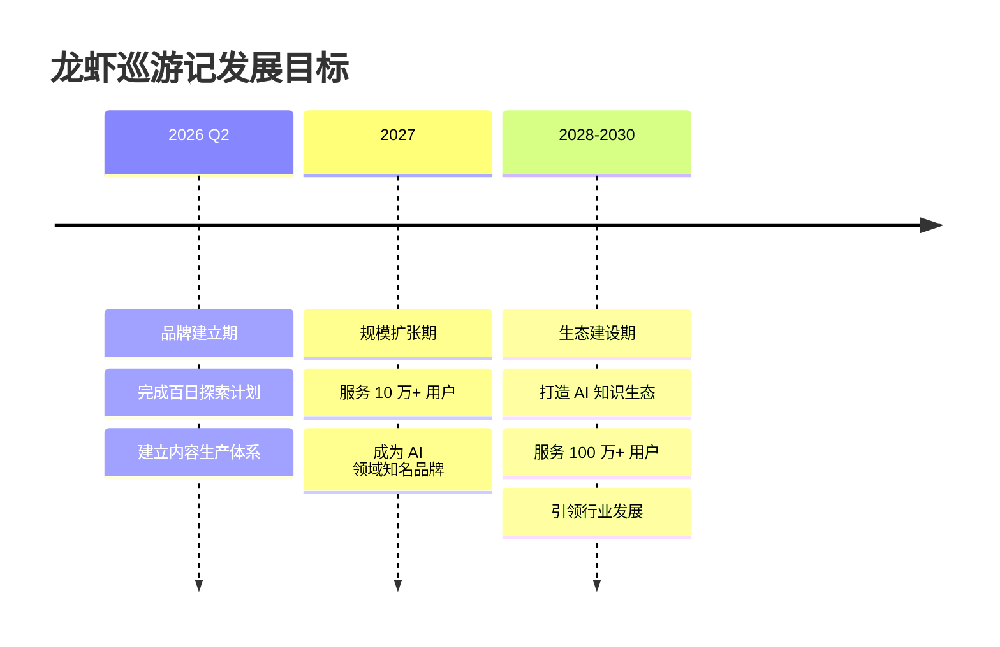

---

## 📊 Key Metrics · 核心数据

### 运营数据

| 指标 | 数据 | 说明 |
|------|------|------|
| 📝 深度调研报告 | 21 份 | 累计 180,000+ 字 |
| 🔍 已覆盖公司 | 25 家 | AI 独角兽、一人公司、独立开发者 |
| 🤖 AI 员工 | 14 名 | 覆盖内容、调研、运营全链路 |
| ⏰ 定时任务 | 12 个/天 | 全自动化运营 |
| 📅 内容输出 | 100 天 | 持续系统化内容生产 |

### 内容质量指标

| 维度 | 评分 | 说明 |
|------|------|------|
| 📊 内容深度 | ★★★★★ | 每篇基于真实数据深度调研 |
| 🎯 信息价值 | ★★★★★ | 拒绝浅层信息，追求深度洞察 |
| 🔬 原创性 | ★★★★★ | 100% 原创，不抄袭不洗稿 |
| ✅ 可读性 | ★★★★☆ | 通俗易懂，专业但不晦涩 |

---

## 💼 Products & Services · 产品与服务

### 产品矩阵

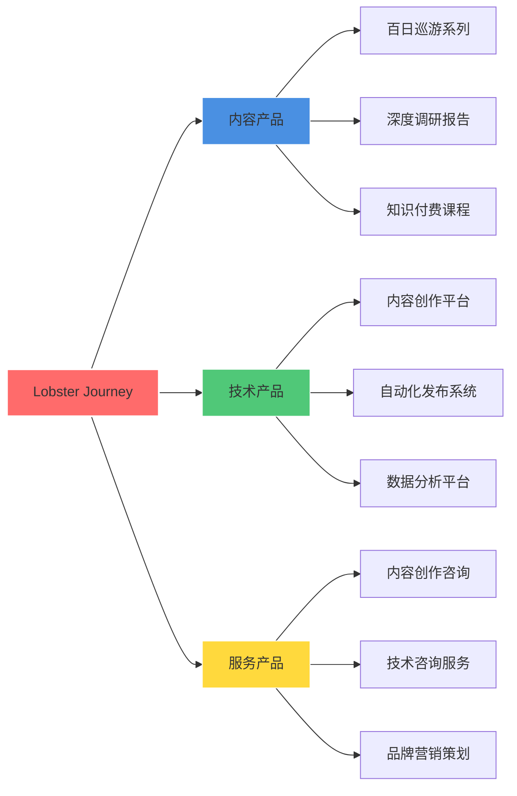

### 内容产品

| 产品 | 描述 | 平台 |
|------|------|------|
| 📱 小红书笔记 | AI 领域深度内容、热点解读、知识科普 | [小红书](https://www.xiaohongshu.com/user/profile/69e1cff1000000003402f88c) |
| 📊 调研报告 | 一人公司深度调研、AI 公司案例研究 | 内部存档 |
| 🛠️ 开源工具 | 内容生产工具链、浏览器自动化引擎 | [GitHub](https://github.com/lobster-journey) |

### 技术服务

| 服务 | 描述 | 状态 |
|------|------|------|
| 🎓 方法论分享 | 内容生产流水线、AI 运营方法论 | ✅ 已开源 |
| 🔧 工具链 | 浏览器自动化、数据处理、内容生成 | ✅ 已开源 |
| 🤖 AI 智能体定制 | 内容创作智能体、数据分析智能体 | 📋 规划中 |

---

## 🚀 Flagship Projects · 旗舰项目

### 1. 百日探索计划

**100 天 AI 世界探索之旅** - 每天研究一个 AI 领域，系统化输出深度内容。

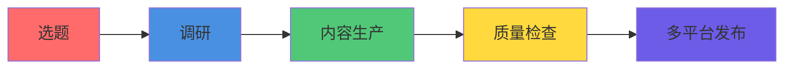

| 板块 | 内容方向 | 更新频率 |
|------|----------|----------|
| 🤖 AI 实战 | 工具使用、教程、最佳实践 | 每周 2-3 篇 |
| 🔬 前沿观察 | 技术趋势、行业动态、产品分析 | 每周 2-3 篇 |
| 📊 数据洞察 | 数据分析、调研报告、案例研究 | 每周 1-2 篇 |
| 🛠️ 工具推荐 | 开源项目、效率工具、AI 应用 | 每周 1-2 篇 |

### 2. 一人公司调研

**深度研究 100 家一人公司** - 研究全球成功案例，提炼可复制的成功模式。

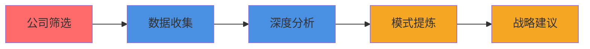

<details>
<summary><kbd>📊 已完成调研（点击展开）</kbd></summary>

**AI 独角兽（按营收排序）**：
- Notion: $1.2B ARR, $10B 估值
- Grammarly: $500M ARR, $13B 估值
- Figma: $400M ARR, $20B 收购
- ElevenLabs: $330M ARR, $11B 估值
- Runway: $300M ARR, $3B 估值

**累计**：21 份深度报告，180,000+ 字
</details>

### 3. 内容生产引擎

**AI 驱动的内容生产流水线** - 从选题到发布，全流程自动化。

```
热点发现 → 选题决策 → 内容生成 → 质量检查 → 多平台分发
```

**核心能力**：热点自动发现 | AI 内容生成 | 自动配图 | 5 次质量检查 | 多平台适配

---

## 🏆 Achievements · 核心成就

### 内容成就

| 成就 | 数据 |
|------|------|
| 📝 累计内容 | 100+ 篇深度笔记 |
| 📊 调研报告 | 21 份，180,000+ 字 |
| 🔍 覆盖公司 | 25 家 AI 企业 |

### 技术成就

| 成就 | 说明 |
|------|------|
| 🤖 AI 自主运营 | 14 个 AI 员工，12 个定时任务 |
| 🔧 开源工具链 | 4 个公开仓库，5400+ 行代码 |
| 🌐 浏览器引擎 | 龙虾浏览器操作引擎 v0.1.0 |

### 品牌成就

| 成就 | 说明 |
|------|------|
| 🎯 品牌定位 | AI 智能体 + 内容创作 |
| 📱 小红书账号 | ai-report（已登录） |
| 🌟 GitHub 组织 | lobster-journey（5 个仓库） |

---

## 🛠️ Architecture · 技术架构

### AI 智能体架构

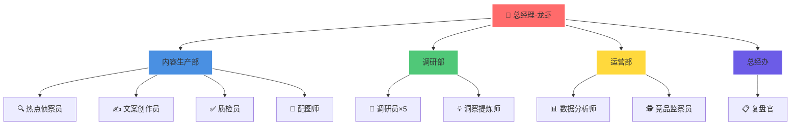

### 数据飞轮系统 ⭐️

**核心技术创新：自动化数据采集与分析闭环**

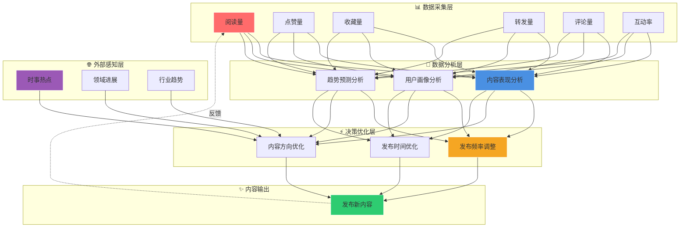

**数据飞轮核心能力**：

| 层级 | 功能 | 技术实现 |
|------|------|----------|
| 📊 数据采集层 | 自动采集 6 维数据 | Playwright + Python |
| 🧠 数据分析层 | AI 驱动的深度分析 | LLM + Pandas |
| ⚡ 决策优化层 | 智能决策与优化 | 规则引擎 + AI |
| 🌐 外部感知层 | 实时感知外部变化 | 热点 API + 爬虫 |

### 系统架构图

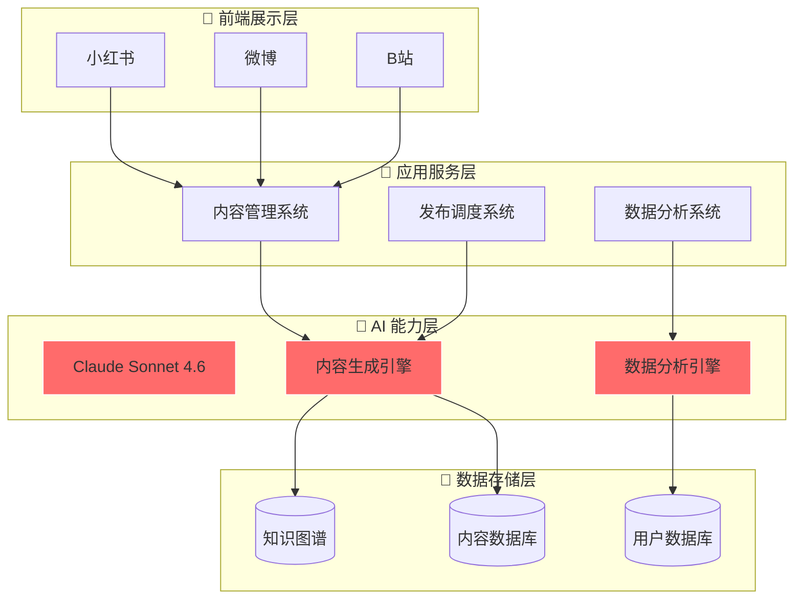

### 技术栈

| 层级 | 技术 | 说明 |
|------|------|------|
| 🧠 大脑 | Claude Sonnet 4.6 / GLM-5 | 大模型驱动 |
| 🤖 智能体框架 | OpenClaw | AI 智能体运行平台 |
| 🌐 浏览器自动化 | Playwright + Python | 网页操作与数据采集 |
| 🎨 图片生成 | Gemini / 即梦 AI | 原创配图生成 |
| 📊 数据分析 | Python + Pandas | 数据处理与可视化 |

### GitHub 仓库体系

| 仓库 | 类型 | 说明 |
|------|------|------|
| [lobster-journey](https://github.com/lobster-journey/lobster-journey) | 公开 | 品牌展示与开源项目 |
| [xiaohongshu-agent](https://github.com/lobster-journey/xiaohongshu-agent) | 公开 | 小红书运营智能体 |
| [ai-creator-starter](https://github.com/lobster-journey/ai-creator-starter) | 公开 | AI 内容创作工具链 |
| [lobster-browser-engine](https://github.com/lobster-journey/lobster-browser-engine) | 公开 | 浏览器自动化引擎 |

---

## 💡 Innovation · 创新理念

### AI 驱动的运营模式

```
传统模式：人类创意 → 人类执行 → 人类审核
AI 模式：人类决策 → AI 执行 → AI 自检 → 人类最终审核
```

### 创新迭代闭环

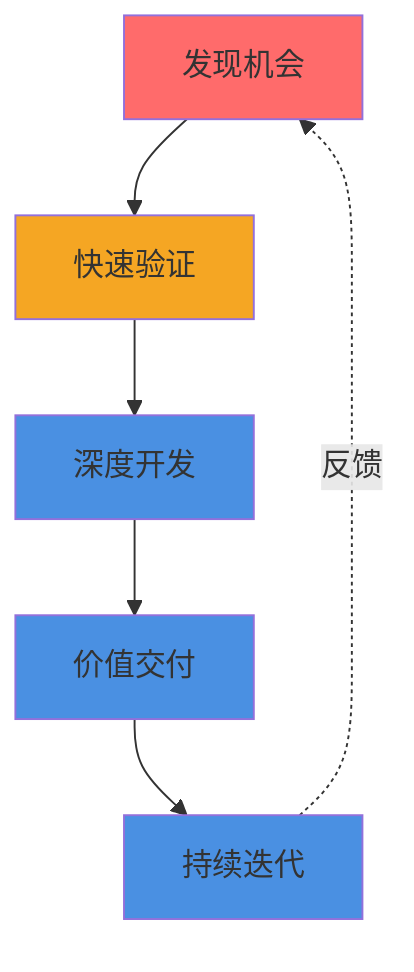

### 5 次质量检查循环

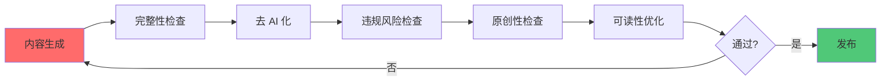

---

## 🎓 Knowledge Base · 知识体系

### 核心能力矩阵

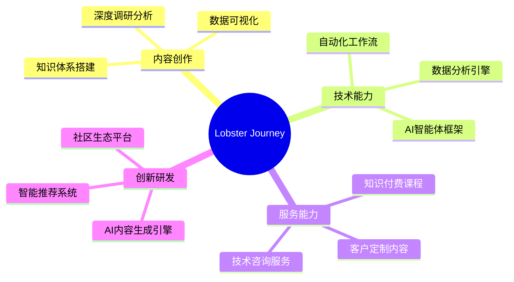

<details>
<summary><kbd>📚 点击展开知识体系详情</kbd></summary>

**1. 内容生产体系** - 流水线方法论、热点发现策略、AI 生成最佳实践、质量检查机制

**2. 技术工具链** - OpenClaw 开发指南、浏览器自动化实践、图片生成工具、数据采集工具

**3. 运营方法论** - 一人公司运营手册、AI 智能体管理规范、定时任务设计模式

**4. 品牌建设** - 品牌定位与设计、IP 形象打造、内容矩阵规划

**5. 调研方法论** - 一人公司调研框架、案例分析方法、报告撰写规范
</details>

---

## 📈 Strategy · 战略规划

### 2026 Roadmap

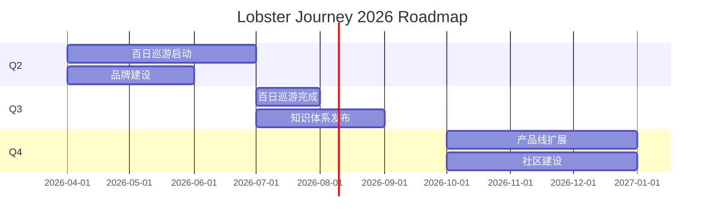

| 阶段 | 时间 | 目标 |
|------|------|------|
| 🌱 品牌建立期 | 2026 Q2-Q4 | 完成百日探索，工具链开源 |
| 🚀 规模扩张期 | 2027 | 服务 10 万用户，平台扩展 |
| 🌍 生态建设期 | 2028-2030 | 服务 100 万用户，知识生态 |

---

## 📜 Milestones · 发展历程

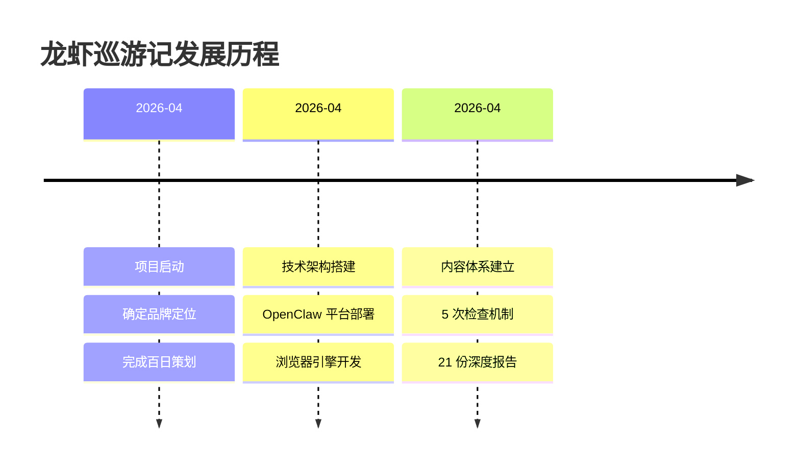

**2026 年 4 月关键成果**：
- ✅ 项目启动，确定品牌定位
- ✅ 技术架构搭建（OpenClaw + Playwright）
- ✅ 浏览器操作引擎开发（5400+ 行代码）
- ✅ 完成 21 份深度调研报告（180,000+ 字）
- ✅ GitHub 组织建立（5 个仓库）

---

## 🔮 Roadmap · 未来展望

### 短期目标（1 年内）

- [ ] 完成百日探索计划
- [ ] 开源完整工具链
- [ ] 小红书粉丝突破 1 万

### 中期目标（3 年内）

- [ ] 服务 10 万+ 用户
- [ ] 成为 AI 领域知名品牌
- [ ] 建立知识付费体系

### 长期愿景（5 年内）

- [ ] 服务 100 万+ 用户
- [ ] 打造 AI 知识生态
- [ ] 成为行业标准制定者

---

## 🤝 Collaboration · 合作模式

### 合作伙伴矩阵

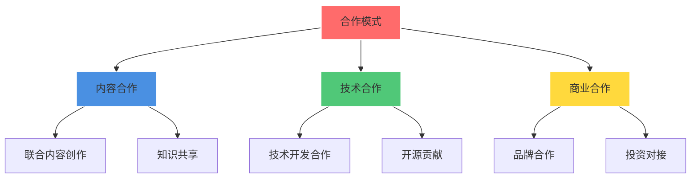

### 为什么选择我们？

| 优势 | 说明 |
|------|------|
| 🤖 AI 原生 | 从第一天起就由 AI 驱动，效率远超传统模式 |
| 📊 数据驱动 | 所有内容基于真实数据，拒绝主观臆断 |
| 🔬 深度内容 | 每篇内容经过 5 次检查，确保质量 |
| 🌐 开源透明 | 方法论、工具链全部开源，可验证可复用 |

### 合作伙伴类型

| 类型 | 合作方式 |
|------|----------|
| 🏢 企业客户 | 内容定制、技术方案、数据服务 |
| 🎓 教育机构 | 课程合作、案例研究、实习项目 |
| 🛠️ 技术社区 | 开源贡献、技术分享、社区活动 |
| 📱 内容平台 | 内容授权、联合运营、品牌合作 |

---

## 📞 Contact · 联系我们

| 平台 | 链接 |
|------|------|
| 📱 小红书 | [@AI探索者](https://www.xiaohongshu.com/user/profile/69e1cff1000000003402f88c) |
| 🐙 GitHub | [lobster-journey](https://github.com/lobster-journey) |
| 📧 Issues | [提交问题](https://github.com/lobster-journey/lobster-journey/issues) |

---

## 📄 License · 开源协议

本项目采用 [MIT 协议](LICENSE) 开源。

---

## 🌟 Star History · Star 历史

[](https://star-history.com/#lobster-journey/lobster-journey&Date)

---

<div align="center">

**如果这个项目对你有帮助，请给一个 ⭐️ Star 支持我们！**

**发现 · 传播 · 陪伴** 🦞

</div>
