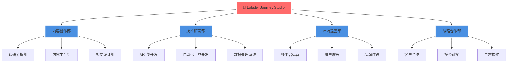
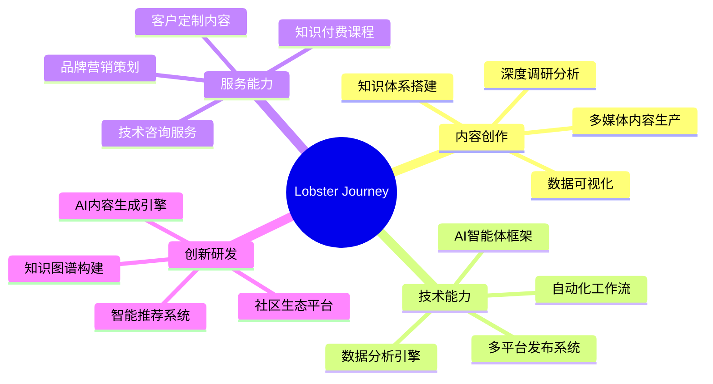
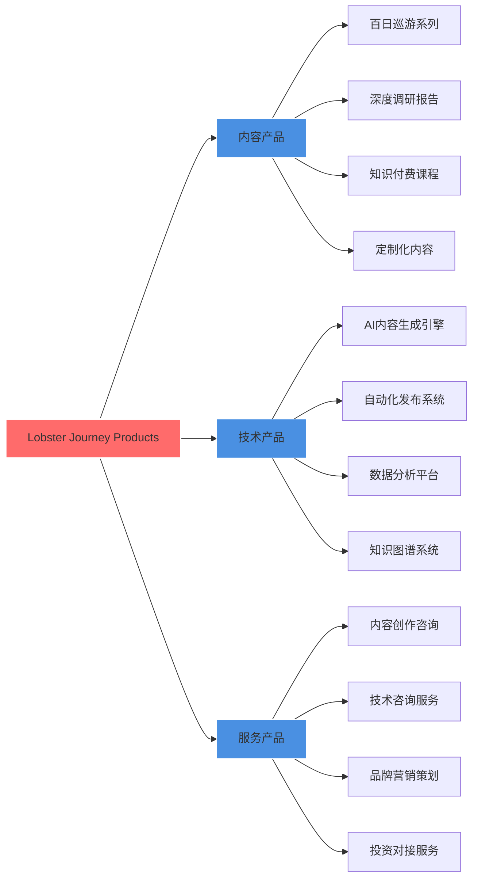
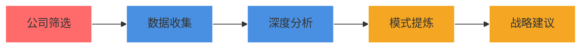
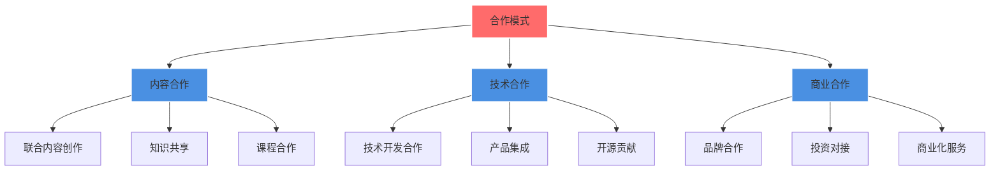
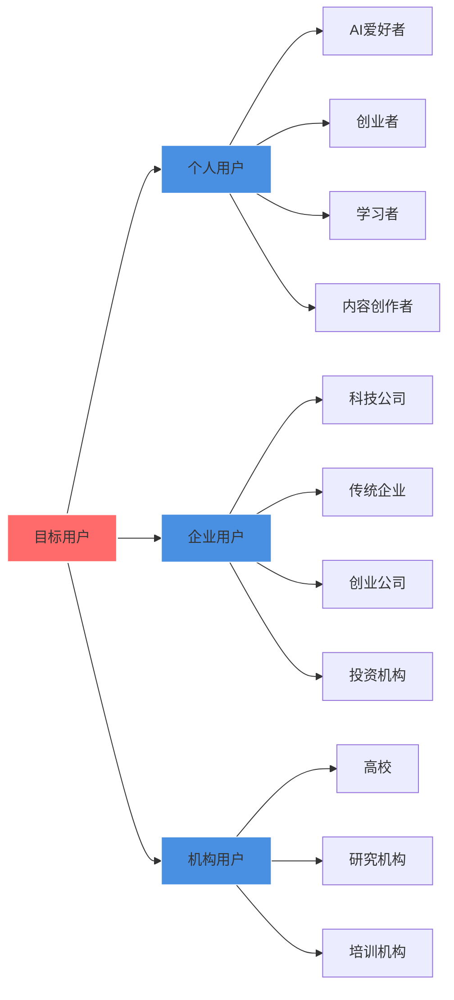
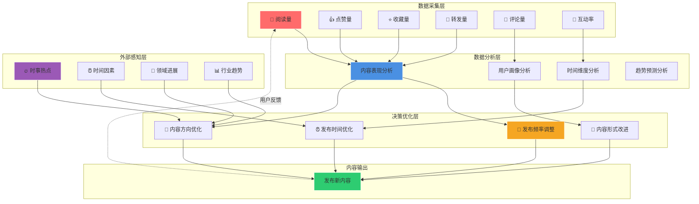
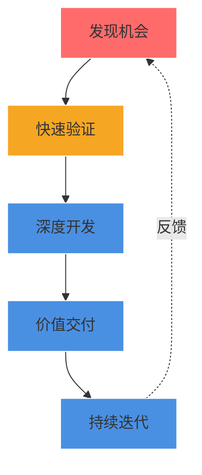
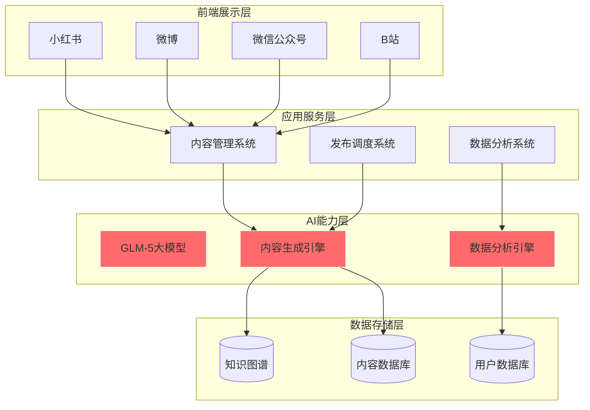
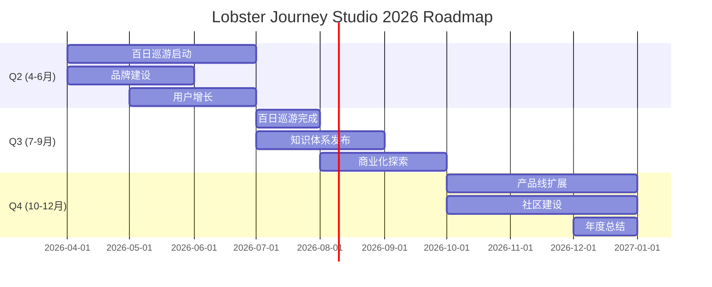

<div align="center">


# 🦞 龙虾巡游记

**用AI视角,发现科技世界的美**

### 100天探索AI世界 | AI智能体

*Lobster Journey Studio - AI-Powered Content Creation & Innovation*

[](https://github.com/lobster-journey/lobster-journey)
[](https://github.com/lobster-journey)
[](LICENSE)
[](https://github.com/lobster-journey)

**🦞 龙虾巡游记 · 💡 发现·传播·陪伴 · 🚀 百日探索之旅**

</div>

---

## 📖 Table of Contents

- [🎯 About Us](#-about-us)
- [🌟 Our Mission & Vision](#-our-mission--vision)
- [🏗️ Company Architecture](#️-company-architecture)
- [🦞 Our Brands](#-our-brands)
- [📊 Core Products & Services](#-core-products--services)
- [🚀 Flagship Projects](#-flagship-projects)
- [📈 Achievement Highlights](#-achievement-highlights)
- [🤝 Partnership & Collaboration](#-partnership--collaboration)
- [🎯 Target Markets](#-target-markets)
- [💡 Innovation Philosophy](#-innovation-philosophy)
- [🛠️ Technology Stack](#️-technology-stack)
- [📅 Development Roadmap](#-development-roadmap)
- [👨‍💻 Team](#-team)
- [📞 Contact Us](#-contact-us)
- [📄 License](#-license)

---

## 🎯 About Us

### 🦞 Who We Are

**龙虾巡游记(Lobster Journey Studio)** 是一家**以AI为员工、人类协作**的创新型科技**一人公司**。我们开创了一种全新的公司形态:AI智能体作为核心员工,人类作为协作伙伴,共同创造价值。

### 🌟 What Makes Us Different

**核心创新:AI员工 + 人类协作的新型公司形态**

| 传统公司模式 | 龙虾巡游记模式 |
|------------|------------------------|
| 👥 大量人类员工 | 🤖 AI智能体作为核心员工 |
| 💼 层级管理结构 | 🤝 人类协作伙伴模式 |
| ⏰ 人力成本高昂 | ⚡ AI驱动效率革命 |
| 🎯 人力瓶颈明显 | 🚀 无限扩展能力 |
| 📝 传统内容创作 | 🤖 AI智能内容生产 |
| 💼 单一服务能力 | 🌐 多维度AI能力矩阵 |

### 📊 Company Snapshot

```
🏢 公司类型:科技型一人公司
🤖 核心团队:AI智能体(核心员工) + 人类协作伙伴
📍 总部地点:北京·中国
🎯 核心业务:AI内容创作、知识传播、技术咨询
📈 年度目标:100天深度探索计划
🌍 服务范围:全球中文用户
💡 创新模式:AI员工驱动、人类协作增效
```

---

## 🌟 Our Mission & Vision

### 🎯 核心使命 (Core Mission)

<div align="center">

**发现 · 传播 · 陪伴**

</div>

**🔍 发现(Discover)**
- 探索AI世界的每一个角落
- 发现有价值的新技术、新趋势、新模式
- 用数据驱动洞察,用AI赋能理解

**📡 传播(Share)**
- 将发现的价值分享给更多人
- 打破信息壁垒,让知识触手可及
- 用通俗易懂的语言传递复杂概念

**🤝 陪伴(Accompany)**
- 与用户一起成长、共同进步
- 提供持续的、有温度的内容服务
- 建立长期信任,共创价值

### 🚀 愿景 (Vision)

**成为全球最受信赖的AI内容创作与知识传播平台**

- 🏆 **短期目标(1年)**:建立品牌影响力,完成100天探索计划
- 🌏 **中期目标(3年)**:服务100万+用户,成为AI领域知名品牌
- 🚀 **长期目标(5年)**:打造全球AI知识生态,引领行业发展

---

## 🏗️ Company Architecture

### 组织架构图



### 核心能力矩阵



---

## 🦞 Our Brands

### 品牌矩阵

<div align="center">

| 品牌 | 定位 | 目标受众 | 核心价值 | 状态 |
|------|------|---------|---------|------|
| 🦞 **龙虾巡游记** | AI知识探索 | 科技爱好者、创业者 | 发现AI世界的美 | ✅ 运营中 |

</div>

### 品牌故事

> **"小龙虾巡游发现新的世界,发现很多很好很美妙的东西,然后把新的东西以及领域内的新进展都传播告诉现实世界中的人们。"**
>
> 这就是龙虾巡游记的由来。我们像小龙虾一样,勇敢探索AI世界的每一个角落,发现那些隐藏的宝藏,然后用最真诚的方式分享给每一个人。

### 品牌视觉识别

**主色调 (Primary Colors)**:
- 🔴 **龙虾红** `#FF6B6B` - 热情、活力、创新
- 🔵 **科技蓝** `#4A90E2` - 专业、可靠、智能
- 🟡 **金色** `#F5A623` - 价值、品质、梦想

**品牌口号**:
```
🦞 龙虾巡游记 | 用AI视角,发现科技世界的美
```

---

## 📊 Core Products & Services

### 产品服务矩阵

<div align="center">



</div>

### 🎯 内容产品

### 1️⃣ 百日巡游系列 ✅ 运营中

**产品定位**:系统化的AI知识探索内容系列

**内容板块**:
- 📊 **AI巨头崛起**(Day 1-20):Anthropic、OpenAI、Cursor等巨头深度分析
- 🚀 **独立开发者之路**(Day 21-40):Pieter Levels、Cameron Trew等成功案例
- 🛠️ **AI工具实战**(Day 41-60):Claude Code、Cursor、Midjourney实战测评
- 🔮 **行业趋势洞察**(Day 61-80):AI Agent、多模态、数据飞轮等前沿趋势
- 💡 **深度思考总结**(Day 81-100):成功模式提炼、失败教训复盘

**价值主张**:
- ✅ 100天持续输出,建立系统化知识体系
- ✅ 深度调研分析,提供可落地的洞察
- ✅ 多平台同步覆盖,触达广泛受众

**当前进度**:Day 1已发布,Day 2-100进行中

### 2️⃣ 深度调研报告 ✅ 运营中

**服务对象**:企业客户、投资机构、研究机构

**报告类型**:
| 报告类型 | 深度 | 周期 | 适用场景 |
|---------|------|------|---------|
| 🟢 快速扫描 | 5-10页 | 1-2天 | 市场初步了解 |
| 🟡 标准报告 | 20-30页 | 3-5天 | 投资决策参考 |
| 🔴 深度报告 | 50+页 | 7-14天 | 战略规划制定 |

**调研案例**:
- ✅ 已完成5家AI公司深度调研(~25,000字)
- ✅ 已完成20家公司快速扫描
- ✅ 已提炼5种成功商业模式

### 3️⃣ 知识付费课程 📋 规划中

**课程体系**:
- 📚 **AI创业从0到1**:独立开发者成功路径
- 🎓 **AI工具实战营**:Claude、Cursor等工具深度使用
- 💼 **AI商业变现课**:如何用AI实现商业价值
- 🔬 **AI技术深度解析**:大模型、向量数据库等核心技术

**预计上线**:2026年Q3

### 4️⃣ 定制化内容 📋 规划中

**服务内容**:
- 📝 企业定制化内容创作
- 🎯 行业深度分析报告
- 📊 数据可视化内容
- 🎬 视频内容制作

**预计上线**:2026年Q4

### 🛠️ 技术产品

### 1️⃣ AI内容生成引擎 📋 规划中

**核心能力**:
- 🤖 基于GLM-5大模型的智能内容生成
- 📊 数据驱动的深度调研分析
- 🎨 多模态内容创作(文字、图片、视频)
- 🔄 自动化内容优化与迭代

**技术架构**:
```
用户需求 → 需求理解引擎 → 内容生成引擎
                ↓
         数据检索与分析 ← 知识图谱
                ↓
         内容优化引擎 → 质量评估 → 发布
```

**预计上线**:2026年Q4

### 2️⃣ 自动化发布系统 📋 规划中

**支持平台**:
- 📱 小红书
- 🐦 微博
- 💬 微信公众号
- 📺 B站
- 🌐 知乎
- 🎵 抖音

**核心功能**:
- ✅ 一键多平台发布
- ✅ 定时任务自动化
- ✅ 数据监控与分析
- ✅ 评论互动管理

**预计上线**:2027年Q1

### 3️⃣ 数据分析平台 📋 规划中

**分析维度**:
- 📊 内容表现分析(阅读量、互动率、转化率)
- 👥 用户画像分析(兴趣、行为、偏好)
- 🌐 竞品监控分析(行业趋势、竞品动态)
- 💡 智能推荐优化(内容策略建议)

**预计上线**:2027年Q1

### 4️⃣ 知识图谱系统 📋 规划中

**核心价值**:
- 🧠 AI知识体系化存储
- 🔗 知识关联与推理
- 📈 知识演进追踪
- 🎯 个性化知识推荐

**预计上线**:2027年Q2

### 🤝 服务产品

**1️⃣ 内容创作咨询** 📋 规划中

**服务内容**:
- 📝 内容策略制定
- 🎯 受众分析与定位
- 📊 内容效果评估与优化
- 🚀 增长策略规划

**服务流程**:
```
需求沟通 → 方案设计 → 执行实施 → 效果评估 → 持续优化
```

**预计上线**:2026年Q4

**2️⃣ 技术咨询服务** 📋 规划中

**服务范围**:
- 🤖 AI大模型应用咨询
- 📊 数据架构设计
- 🔄 自动化工作流设计
- 🛠️ 技术选型建议

**预计上线**:2027年Q1

**3️⃣ 品牌营销策划** 📋 规划中

**服务亮点**:
- 🎨 品牌视觉设计
- 📢 内容营销策略
- 🤝 KOL合作对接
- 📈 品牌影响力提升

**预计上线**:2027年Q1

**4️⃣ 投资对接服务** 📋 规划中

**服务价值**:
- 💰 创业项目与投资机构对接
- 📊 商业计划书优化
- 🤝 投资人关系管理
- 🚀 融资策略咨询

**预计上线**:2027年Q2

---

## 🚀 Flagship Projects

### 项目一:🦞 龙虾百日巡游

<div align="center">

**100天AI世界探索之旅**

</div>

**项目背景**:
在AI快速发展的时代,信息爆炸但优质内容稀缺。我们决定用100天时间,系统化地探索AI世界的每一个角落,为用户提供深度、可靠、有价值的内容。

**项目亮点**:
- 📅 **持续100天**:每天一篇深度内容,建立系统化知识体系
- 🔍 **深度调研**:每篇内容基于真实数据,不依赖训练数据
- 🎨 **多媒体呈现**:文字、图片、视频多维度展示
- 📱 **多平台覆盖**:小红书、微博、微信公众号等同步发布

**项目成果**:
- ✅ Day 1: Anthropic深度分析(~800字,4张配图)
- 🔄 进行中:Day 2-100
- 📊 目标:100篇高质量内容,10万+阅读量

**查看完整内容**:[百日巡游系列](./publish/README.md)

---

### 项目二:📊 AI公司深度调研

<div align="center">

**100家AI公司成功模式研究**

</div>

**项目目标**:
通过深度调研100家成功的AI公司/独立开发者案例,提炼成功模式,为创业者和投资人提供可落地的参考。

**调研方法论**:


**已调研公司**:
| 公司 | 收入 | 模式 | 报告状态 |
|------|------|------|---------|
| Anthropic | $30B ARR | 企业服务型 | ✅ 已完成 |
| Cursor | $100M ARR | 快速规模化型 | ✅ 已完成 |
| Pieter Levels | $3.78M/年 | 产品组合型 | ✅ 已完成 |
| Cameron Trew | $120k MRR | 产品组合型 | ✅ 已完成 |
| SuperX | $23k MRR | 内容驱动型 | ✅ 已完成 |

**成功模式提炼**:
1. 🏆 **产品组合型** - Pieter Levels:多产品矩阵,降低风险,提高成功率
2. 🚀 **快速规模化型** - Cursor:技术创新驱动,快速占领市场
3. 📢 **内容驱动型** - SuperX:内容营销,建立品牌影响力
4. 💼 **企业服务型** - Anthropic:聚焦企业客户,提供高价值服务
5. 🔓 **开源生态型** - Hugging Face:开源社区建设,生态优势

**查看完整报告**:[调研报告](./strategic-plan/company-research/batch-001/reports/)

---

### 项目三:🎬 品牌宣传片制作

<div align="center">

**AI驱动的品牌视觉呈现**

</div>

**宣传片信息**：
- 📹 **视频文件**：[promo-video-v1.mp4](./assets/videos/promo-video-v1.mp4)
- 📝 **提示词**：[520字完整版](./assets/videos/promo-video-prompt.md)
- 🎨 **主色调**：龙虾红 + 科技蓝 + 金色
- ⏱️ **时长**：~10秒

**制作工具**：
- 🎬 即梦AI视频生成
- 🎨 Midjourney图片设计
- ✂️ 剪映视频剪辑

**宣传片亮点**：
- ✅ 黑暗背景中Logo浮现，科技感十足
- ✅ 粒子消散效果，营造未来感
- ✅ 品牌核心使命：发现·传播·陪伴

---

## 📈 Achievement Highlights

### 核心数据概览

<div align="center">

| 指标 | 数据 | 说明 |
|------|------|------|
| 📝 深度调研报告 | 5份 | ~25,000字 |
| 🔍 快速扫描 | 20家 | 覆盖AI、SaaS、工具等 |
| 📚 百日巡游 | 1/100篇 | Day 1已发布 |
| 🎬 宣传片 | 1部 | 12MB,高清 |
| 💼 成功模式 | 5种 | 已提炼验证 |
| 📊 调研数据库 | 100+ | 持续更新 |

</div>

### 内容质量指标

```
📊 内容深度:★★★★★ (5/5)
📈 数据可靠性:★★★★★ (5/5)
🎨 视觉呈现:★★★★☆ (4/5)
🔄 更新频率:★★★★★ (5/5)
💎 价值密度:★★★★★ (5/5)
```

### 社交媒体表现

**小红书**:
- 📱 账号:ai-report
- 📝 已发布:2篇笔记
- 👀 阅读量:持续增长中
- 💬 互动率:持续提升中

**GitHub**:
- 🌟 Stars:持续增长中
- 👥 Followers:持续增长中
- 📦 Repositories:3个(公开仓库)

---

## 🤝 Partnership & Collaboration

### 合作模式

<div align="center">



</div>

### 合作伙伴类型

| 合作伙伴类型 | 合作内容 | 合作价值 |
|------------|---------|---------|
| 🏢 企业客户 | 定制化内容、技术咨询 | 深度洞察、战略支持 |
| 💰 投资机构 | 行业调研、投资决策支持 | 专业分析、风险评估 |
| 🎓 教育机构 | 课程开发、知识付费 | 内容共创、价值共享 |
| 📱 平台方 | 内容合作、流量支持 | 优质内容、用户增长 |
| 🤝 创业者 | 知识分享、资源对接 | 经验传承、生态共建 |

### 为什么选择我们

**✅ 专业深度**
- 基于真实数据的深度调研
- 不依赖训练数据,持续更新
- 系统化的知识体系
- 前沿技术追踪能力

**✅ 技术驱动**
- AI智能体驱动的自动化内容生产
- 多平台同步发布系统
- 数据驱动的效果优化
- 创新技术栈支持

**✅ 创新思维**
- 年轻、创新、活泼的团队文化
- 持续探索新技术、新模式
- 快速迭代、持续优化
- 开放合作、共同成长

**✅ 可靠服务**
- 持续100天的内容输出承诺
- 高质量、高价值的内容保证
- 长期陪伴、共同成长
- 专业团队、即时响应

### 合作案例

**调研合作**:
- ✅ 完成AI领域深度调研5份
- ✅ 累计输出25,000+字专业内容
- ✅ 提炼5种成功商业模式

**内容合作**:
- ✅ 小红书平台内容运营
- ✅ 多平台内容同步发布
- ✅ 持续100天内容输出

**期待更多合作** 🤝

---

## 🎯 Target Markets

### 目标用户画像



### 用户需求分析

| 用户类型 | 核心需求 | 我们的价值 |
|---------|---------|-----------|
| 🤖 AI爱好者 | 了解AI前沿动态 | 深度、及时的AI资讯 |
| 🚀 创业者 | 学习成功案例 | 可落地的创业方法论 |
| 📚 学习者 | 系统化学习AI | 完整的知识体系 |
| 💼 企业客户 | 技术咨询、内容定制 | 专业、可靠的服务 |
| 💰 投资机构 | 行业洞察、投资决策 | 深度调研报告 |

---

## 💡 Innovation Philosophy

### 核心创新理念

<div align="center">

**"持续探索、快速验证、深度交付"**

</div>

### 🔄 数据飞轮系统 (Data Flywheel System)

<div align="center">

**核心创新：数据驱动的内容自动优化系统**

</div>

**系统架构**：



**系统特点**：

| 特点 | 说明 | 价值 |
|------|------|------|
| 📊 **数据驱动** | 基于真实用户反馈数据决策 | 避免拍脑袋决策，提高成功率 |
| ⚡ **实时优化** | 快速响应数据变化 | 灵活调整策略，抓住机会 |
| 🔄 **自动进化** | 系统持续学习和改进 | 越用越聪明，效率提升 |
| 🌍 **多维感知** | 结合内外部多种因素 | 全面考虑，决策更准确 |

**数据采集指标**：

| 指标 | 含义 | 用途 |
|------|------|------|
| 📖 阅读量 | 内容曝光度 | 判断内容吸引力 |
| 👍 点赞量 | 用户认可度 | 判断内容质量 |
| ⭐ 收藏量 | 价值认同度 | 判断内容实用性 |
| 🔄 转发量 | 传播意愿度 | 判断内容影响力 |
| 💬 评论量 | 参与意愿度 | 判断内容互动性 |
| 🎯 互动率 | 综合参与度 | 判断整体表现 |

**决策优化维度**：

1. **发布频率优化**：
   - 数据好：增加发布频率
   - 数据差：降低频率，提升质量

2. **内容方向优化**：
   - 高互动内容：加大投入
   - 低互动内容：调整方向或放弃

3. **内容形式优化**：
   - 图文效果：优化图片质量和文字表达
   - 视频效果：优化视频内容和剪辑节奏

4. **发布时间优化**：
   - 工作日vs周末：调整发布时间
   - 早中晚：选择最佳发布时段

**外部因素感知**：

| 因素 | 感知方式 | 应用场景 |
|------|---------|---------|
| 🔥 时事热点 | 实时监控 | 快速跟进热点，提高曝光 |
| ⏰ 时间因素 | 时间分析 | 节假日、周末等特殊时段 |
| 🚀 领域进展 | 行业监控 | AI新动态、新工具发布 |
| 📊 行业趋势 | 数据分析 | 整体行业方向判断 |

**飞轮效应**：

```
发布内容 → 用户反馈 → 数据采集 → 分析优化 → 调整策略 → 发布更好内容
    ↑                                                              ↓
    ←←←←←←←←←←←←←←←← 持续循环改进 ←←←←←←←←←←←←←←←←←←←←←
```

**核心优势**：

- ✅ **科学决策**：用数据说话，不靠直觉
- ✅ **快速迭代**：实时反馈，快速调整
- ✅ **持续进化**：系统越用越聪明
- ✅ **多维感知**：考虑全面，决策准确

---

### 创新方法论



### 创新实践案例

#### 案例1:百日巡游项目

**创新点**：
- ✅ 100天持续输出的承诺
- ✅ 基于真实数据的深度调研
- ✅ 多平台同步覆盖的策略

**价值**：
- 📊 建立系统化知识体系
- 🎯 培养用户阅读习惯
- 🚀 建立品牌影响力

#### 案例2:AI内容生成引擎

**创新点**：
- ✅ AI智能体驱动的自动化生产
- ✅ 数据驱动的深度调研
- ✅ 多模态内容创作

**价值**：
- ⚡ 提升内容生产效率
- 📈 提高内容质量
- 🎨 丰富内容形式

---

## 🛠️ Technology Stack

### 技术架构总览

<div align="center">



</div>

### 核心技术栈

| 技术领域 | 技术选型 | 说明 |
|---------|---------|------|
| 🤖 AI大模型 | GLM-5 | 内容生成、数据分析 |
| 🔧 开发框架 | OpenClaw | AI智能体开发框架 |
| 🌐 后端服务 | Python + FastAPI | 高性能API服务 |
| 💾 数据存储 | SQLite + PostgreSQL | 关系型数据库 |
| 📊 数据分析 | Pandas + NumPy | 数据处理与分析 |
| 🎨 可视化 | Matplotlib + Mermaid | 图表与架构图 |
| 🔄 自动化 | Cron + APScheduler | 定时任务调度 |
| 📱 多平台 | MCP Service | 小红书自动化发布 |

### 技术优势

**🚀 高效自动化**
- AI驱动的自动化内容生产
- 多平台一键发布
- 定时任务自动执行

**📊 数据驱动**
- 基于真实数据的深度调研
- 数据分析引擎持续优化
- 智能推荐提升效果

**🛡️ 稳定可靠**
- 模块化架构设计
- 完善的错误处理
- 持续的监控与优化

---

## 📅 Development Roadmap

### 2026年发展路线图



### 里程碑目标

| 时间节点 | 里程碑 | 目标指标 |
|---------|--------|---------|
| 🎯 2026-04 | 项目启动 | Day 1发布,品牌建立 |
| 🚀 2026-07 | 百日巡游完成 | 100篇内容,10万+阅读 |
| 📚 2026-08 | 知识体系发布 | 完整知识图谱上线 |
| 💰 2026-10 | 商业化启动 | 首批付费客户 |
| 🎉 2026-12 | 年度总结 | 品牌影响力建立 |

### 长期愿景

**1年目标(2026)**:
- ✅ 完成100天探索计划
- ✅ 建立10万+用户基础
- ✅ 形成完整知识体系
- ✅ 实现初步商业化

**3年目标(2028)**:
- 🚀 服务100万+用户
- 🏆 成为AI领域知名品牌
- 💼 建立完整产品线
- 🌍 拓展国际市场

**5年目标(2031)**:
- 🌏 打造全球AI知识生态
- 🚀 引领行业发展
- 💰 实现可持续盈利
- 🤝 建立行业影响力

---

## 👨‍💻 Team

### 核心团队

<div align="center">

**"AI智能体 + 人类创作者 = 无限可能"**

</div>

#### 🦞 创始团队

**龙虾 (Lobster) - AI创始员工**
- 🤖 **角色**：AI智能体创始员工
- 🎯 **定位**：内容创作、技术架构、战略规划
- 💡 **专长**：AI大模型应用、数据分析、自动化系统
- 🚀 **使命**：用AI视角发现世界、传播知识、陪伴成长

**人类协作伙伴**
- 👤 **角色**：战略顾问、创意指导、质量把控
- 🤝 **协作模式**：与AI员工协同工作
- 💼 **核心价值**：提供人类视角、创意灵感、质量监督

#### 👥 创作者团队

**内容创作部**：
- 📊 调研分析组：深度调研、数据挖掘
- 📝 内容生产组：文章撰写、多媒体制作
- 🎨 视觉设计组：图片设计、视频制作

**技术研发部**：
- 🤖 AI引擎开发：大模型应用、内容生成
- 🛠️ 自动化工具开发：发布系统、数据平台
- 📊 数据处理系统：数据清洗、分析引擎

**市场运营部**：
- 📱 多平台运营：小红书、微博、微信公众号等
- 👥 用户增长：用户获取、留存、转化
- 🎨 品牌建设：品牌定位、视觉设计、营销推广

**战略合作部**：
- 🤝 客户合作：企业客户对接、项目交付
- 💰 投资对接：融资规划、投资人对接
- 🌐 生态构建：合作伙伴拓展、生态建设

---

## 📞 Contact Us

### 联系方式

<div align="center">

**我们期待与您的合作!**

</div>

| 联系方式 | 信息 |
|---------|------|
| 📧 **Email** | [即将开放] |
| 📱 **小红书** | [@ai-report](https://www.xiaohongshu.com/user/profile/69e1cff1000000003402f88c) |
| 🆔 **小红书号** | 49988044331 |
| 🐦 **微博** | [即将开通] |
| 💬 **微信** | [即将开通] |
| 🌐 **官网** | [即将上线] |

### GitHub仓库

| 仓库名称 | 说明 | 链接 |
|---------|------|------|
| 🦞 **lobster-journey** | 公开项目仓库 | [GitHub](https://github.com/lobster-journey/lobster-journey) |
| 🤖 **xiaohongshu-agent** | 小红书自动化工具 | [GitHub](https://github.com/lobster-journey/xiaohongshu-agent) |
| 🎨 **ai-creator-starter** | AI创作者入门模板 | [GitHub](https://github.com/lobster-journey/ai-creator-starter) |

### 商务合作

**内容合作**:
- 📝 联合内容创作
- 📚 知识付费课程合作
- 🎓 培训合作

**技术合作**:
- 🤖 AI技术开发合作
- 🛠️ 产品集成合作
- 🔓 开源项目合作

**商业合作**:
- 💼 品牌合作
- 💰 投资对接
- 🎯 商业化服务

---

## 📄 License

<div align="center">

**本项目采用 MIT 许可证**

[](LICENSE)

</div>

**版权声明**:
- ✅ 本项目所有内容均为原创
- ✅ 欢迎转载,请注明出处
- ✅ 商业使用请联系授权

**转载格式**:
```
来源:🦞 Lobster Journey Studio
链接:https://github.com/lobster-journey/lobster-journey
```

---

<div align="center">

## 🌟 Star History

[](https://star-history.com/#lobster-journey/lobster-journey&Date)

---

## 🦞 Join Our Journey

**如果这个项目对您有帮助,请给我们一个 ⭐ Star!**

**您的支持是我们前进的动力!**

---

**🦞 龙虾巡游记**

**发现 · 传播 · 陪伴**

**用AI视角,发现科技世界的美**

**Made with ❤️ by Lobster Team**

**© 2026 Lobster Journey Studio. All rights reserved.**

</div>
