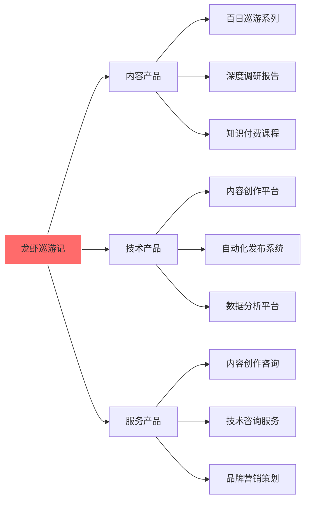
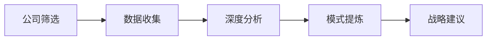
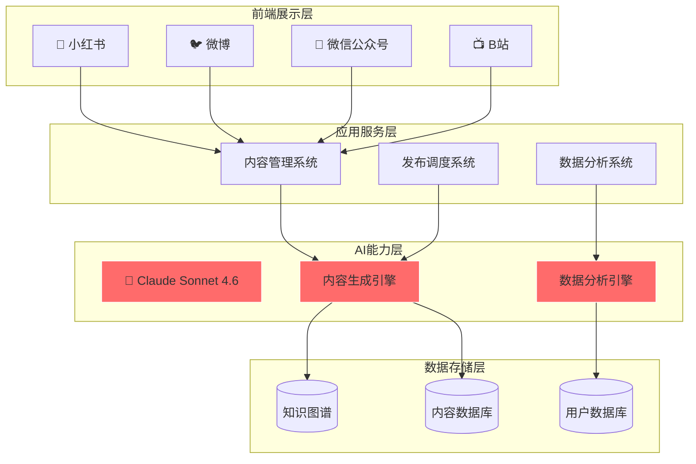
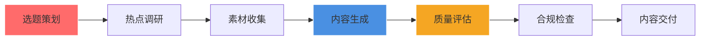
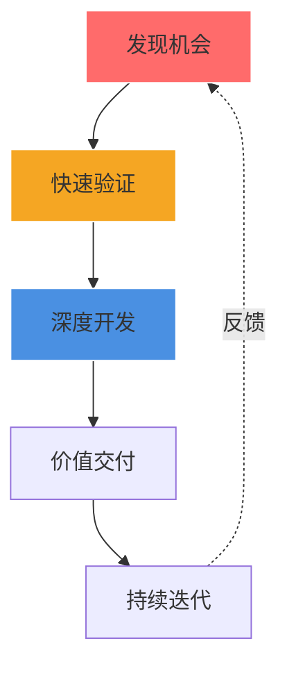
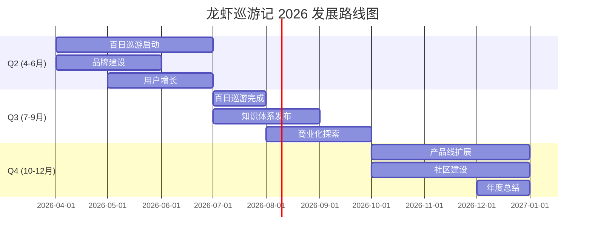
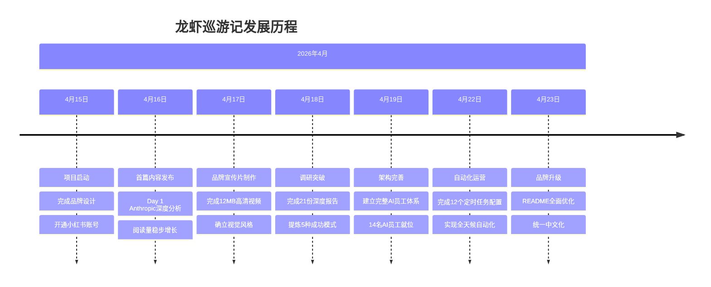
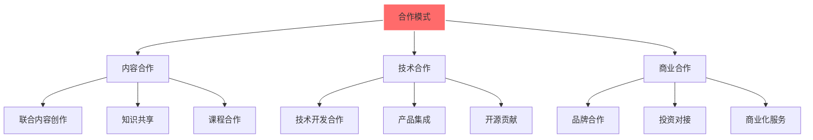

<div align="center">


# 🦞 龙虾巡游记

**用AI视角，发现科技世界的美**

### AI智能体驱动的创新内容工作室

[](https://github.com/lobster-journey/lobster-journey)
[](LICENSE)

**发现 · 传播 · 陪伴**

</div>

---

## 📖 目录

**认识我们**
- [🎯 关于我们](#-关于我们)
- [🌟 使命与愿景](#-使命与愿景)
- [📊 核心数据](#-核心数据)

**我们的价值**
- [💼 产品与服务](#-产品与服务)
- [🚀 旗舰项目](#-旗舰项目)
- [🏆 核心成就](#-核心成就)

**技术与方法**
- [🛠️ 技术架构](#️-技术架构)
- [💡 创新理念](#-创新理念)
- [🎓 知识体系](#-知识体系)

**发展规划**
- [📈 战略规划](#-战略规划)
- [📜 发展历程](#-发展历程)
- [🔮 未来展望](#-未来展望)

**合作联系**
- [🤝 合作模式](#-合作模式)
- [📞 联系我们](#-联系我们)
- [📄 开源协议](#-开源协议)

---

## 🎯 关于我们

<div align="center">

**一人公司 · AI驱动 · 内容为王**

</div>

### 🦞 我们是谁

**龙虾巡游记**是一家以**AI智能体为核心员工**的创新型科技工作室。我们开创了一种全新的公司形态：AI负责内容生产与日常运营，人类专注于战略决策与创意方向，实现效率与质量的完美平衡。

**核心模式**：
```
🤖 AI员工（14名）     → 内容生产、数据分析、自动化运营
👤 人类协作伙伴        → 战略决策、创意把控、风险管理
📊 数据驱动决策        → 实时优化、持续进化
```

### 🌟 我们的与众不同

| 维度 | 传统内容团队 | 龙虾巡游记 |
|------|-------------|-----------|
| **团队规模** | 10-50人 | 1人 + 14名AI员工 |
| **内容产能** | 人均10篇/月 | AI驱动50+篇/月 |
| **运营成本** | 高（人力+管理） | 低（AI订阅费） |
| **响应速度** | 工作日8小时 | 全天候自动化 |
| **内容质量** | 依赖个人能力 | 标准化质量体系 |
| **扩展能力** | 线性增长 | 无限扩展 |

### 📋 公司概览

```
🏢 公司类型   科技型一人公司
📍 总部位置   北京·中国
🎯 核心业务   AI内容创作、深度调研、知识传播
📊 年度目标   100天深度探索计划
🌍 服务范围   全球中文用户
💡 创新模式   AI员工驱动 + 人类协作增效
```

---

## 🌟 使命与愿景

<div align="center">

### 🎯 核心使命

**发现 · 传播 · 陪伴**

</div>

<table>
<tr>
<td width="33%" align="center">

### 🔍 发现

探索AI世界的每一个角落

发现有价值的新技术、新趋势、新模式

用数据驱动洞察，用AI赋能理解

</td>
<td width="33%" align="center">

### 📡 传播

将发现的价值分享给更多人

打破信息壁垒，让知识触手可及

用通俗易懂的语言传递复杂概念

</td>
<td width="33%" align="center">

### 🤝 陪伴

与用户一起成长、共同进步

提供持续的、有温度的内容服务

建立长期信任，共创价值

</td>
</tr>
</table>

### 🚀 发展愿景

**成为全球最受信赖的AI内容创作与知识传播平台**

| 阶段 | 时间 | 目标 |
|------|------|------|
| 🏆 **短期** | 1年内 | 建立品牌影响力，完成100天探索计划 |
| 🌏 **中期** | 3年内 | 服务100万+用户，成为AI领域知名品牌 |
| 🚀 **长期** | 5年内 | 打造全球AI知识生态，引领行业发展 |

---

## 📊 核心数据

<div align="center">

**用数据说话，让成果可见**

</div>

### 📈 运营数据

| 指标 | 数据 | 说明 |
|------|------|------|
| 📝 **深度调研报告** | 21份 | 累计180,000+字专业内容 |
| 🔍 **已覆盖公司** | 25家 | AI独角兽、一人公司、独立开发者 |
| 🎬 **品牌宣传片** | 1部 | 12MB高清视频 |
| 💼 **成功模式提炼** | 5种 | 已验证可落地的商业模式 |
| 🤖 **AI员工** | 14名 | 覆盖内容、调研、运营全链路 |
| ⏰ **定时任务** | 12个/天 | 全自动化运营 |
| 📦 **GitHub仓库** | 5个 | 开源贡献持续增长 |

### 🏆 质量指标

| 维度 | 评分 | 说明 |
|------|------|------|
| 📊 **内容深度** | ★★★★★ | 每篇基于真实数据深度调研 |
| 📈 **数据可靠性** | ★★★★★ | 多源验证，交叉核对 |
| 🎨 **视觉呈现** | ★★★★☆ | 多模态内容，持续优化 |
| 🔄 **更新频率** | ★★★★★ | 每日更新，持续输出 |
| 💎 **价值密度** | ★★★★★ | 高信息密度，可落地性强 |

### 📱 社交媒体表现

**小红书账号**：[@龙虾巡游记](https://www.xiaohongshu.com/user/profile/69e1cff1000000003402f88c)
- 📝 已发布：3篇深度内容（Day 0启动 + Day 1-2行业分析）
- 🎯 内容方向：AI热点、技术干货、行业洞察
- 📈 数据趋势：持续增长中

**GitHub**：
- 🌟 Stars：持续增长中
- 📦 Repositories：5个公开仓库
- 🤝 Contributors：欢迎贡献

---

## 💼 产品与服务

<div align="center">

**从内容到技术，全方位服务能力**

</div>

### 📦 产品矩阵



### 🎯 内容产品

#### 百日巡游系列 ✅ 运营中

**产品定位**：系统化的AI知识探索内容系列

**内容板块**：
- 📊 **AI巨头崛起**（Day 1-20）：Anthropic、OpenAI、Cursor等巨头深度分析
- 🚀 **独立开发者之路**（Day 21-40）：Pieter Levels、Cameron Trew等成功案例
- 🛠️ **AI工具实战**（Day 41-60）：Claude、Cursor、Midjourney实战测评
- 🔮 **行业趋势洞察**（Day 61-80）：AI Agent、多模态、数据飞轮等前沿趋势
- 💡 **深度思考总结**（Day 81-100）：成功模式提炼、失败教训复盘

**价值主张**：
- ✅ 100天持续输出，建立系统化知识体系
- ✅ 深度调研分析，提供可落地的洞察
- ✅ 多平台同步覆盖，触达广泛受众

#### 深度调研报告 ✅ 运营中

**服务对象**：企业客户、投资机构、研究机构

**报告类型**：

| 类型 | 深度 | 周期 | 适用场景 |
|------|------|------|---------|
| 🟢 快速扫描 | 5-10页 | 1-2天 | 市场初步了解 |
| 🟡 标准报告 | 20-30页 | 3-5天 | 投资决策参考 |
| 🔴 深度报告 | 50+页 | 7-14天 | 战略规划制定 |

**调研成果**：
- ✅ 已完成21份深度调研报告（~180,000字）
- ✅ 已覆盖25家公司（含AI独角兽、一人公司、独立开发者）
- ✅ 已提炼5种成功商业模式

#### 知识付费课程 📋 规划中

**课程体系**：
- 📚 **AI创业从0到1**：独立开发者成功路径
- 🎓 **AI工具实战营**：Claude、Cursor等工具深度使用
- 💼 **AI商业变现课**：如何用AI实现商业价值

**预计上线**：2026年Q3

### 🛠️ 技术产品

#### 内容创作平台 📋 规划中

**支持平台**：小红书、微博、微信公众号、B站、知乎、抖音

**核心功能**：
- 🤖 智能内容生成与优化
- 📊 数据驱动的深度调研分析
- 🎨 多模态内容创作（文字、图片、视频）
- 🔄 自动化内容优化与迭代

**预计上线**：2026年Q4

#### 自动化发布系统 📋 规划中

**核心能力**：
- ✅ 一键多平台发布
- ✅ 定时任务自动化
- ✅ 数据监控与分析
- ✅ 评论互动管理

**预计上线**：2027年Q1

### 🤝 服务产品

| 服务 | 内容 | 适用客户 | 预计上线 |
|------|------|---------|---------|
| **内容创作咨询** | 内容策略、受众分析、效果优化 | 企业客户 | 2026年Q4 |
| **技术咨询服务** | AI应用咨询、数据架构设计 | 科技公司 | 2027年Q1 |
| **品牌营销策划** | 品牌视觉、内容营销、KOL对接 | 创业公司 | 2027年Q1 |

---

## 🚀 旗舰项目

<div align="center">

**三大核心项目，展示实战能力**

</div>

### 项目一：🦞 龙虾百日巡游

**100天AI世界探索之旅**

<table>
<tr>
<td width="50%">

**项目背景**

在AI快速发展的时代，信息爆炸但优质内容稀缺。我们决定用100天时间，系统化地探索AI世界的每一个角落，为用户提供深度、可靠、有价值的内容。

</td>
<td width="50%">

**项目亮点**

- 📅 持续100天，每天一篇深度内容
- 🔍 基于真实数据，不依赖训练数据
- 🎨 多媒体呈现，多平台覆盖
- 📱 小红书、微博、微信同步发布

</td>
</tr>
</table>

**项目进度**：
- ✅ Day 1-2：Anthropic、Agent生态深度分析（已发布）
- 🔄 进行中：Day 3-100
- 🎯 目标：100篇高质量内容，10万+阅读量

---

### 项目二：📊 AI公司深度调研

**100家AI公司成功模式研究**

<div align="center">

**通过深度调研100家成功的AI公司/独立开发者案例，提炼成功模式，为创业者和投资人提供可落地的参考**

</div>

**调研方法论**：



**成功模式提炼**：

| 模式 | 代表案例 | 核心特征 | 成功要素 |
|------|---------|---------|---------|
| 🏆 **产品组合型** | Pieter Levels | 多产品矩阵，降低风险 | 快速试错、数据驱动 |
| 🚀 **快速规模化型** | Cursor | 技术创新驱动，快速占领市场 | 产品力、融资能力 |
| 📢 **内容驱动型** | SuperX | 内容营销建立品牌影响力 | 内容质量、持续输出 |
| 💼 **企业服务型** | Anthropic | 聚焦企业客户，高价值服务 | 技术壁垒、客户关系 |
| 🔓 **开源生态型** | Hugging Face | 开源社区建设，生态优势 | 社区运营、开发者关系 |

---

### 项目三：🎬 品牌宣传片

**AI驱动的品牌视觉呈现**

**宣传片信息**：
- 📹 视频文件：[promo-video-v1.mp4](./assets/videos/promo-video-v1.mp4)
- 🎨 主色调：龙虾红 + 科技蓝 + 金色
- ⏱️ 时长：~10秒

**制作亮点**：
- ✅ 黑暗背景中Logo浮现，科技感十足
- ✅ 粒子消散效果，营造未来感
- ✅ 品牌核心使命：发现·传播·陪伴

---

## 🏆 核心成就

<div align="center">

**从零到一，稳步前行**

</div>

### 📊 调研成果

**深度调研21家公司**，覆盖多个领域：

| 类别 | 公司代表 | 核心发现 |
|------|---------|---------|
| 🦄 **AI独角兽** | Anthropic、Cursor、Perplexity | 技术创新 + 快速规模化路径 |
| 👤 **一人公司** | Pieter Levels、Cameron Trew | 产品组合 + 数据驱动增长 |
| 🛠️ **开发者工具** | Replit、Vercel、Supabase | 开发者生态 + 社区运营 |
| 🎨 **创作工具** | Midjourney、Runway、ElevenLabs | 创作者市场 + 平台化思维 |

### 💎 模式提炼

**5种已验证的商业模式**：

```
1. 产品组合型 ─────→ 多产品矩阵，分散风险，提高成功率
2. 快速规模化型 ───→ 技术驱动，融资加速，快速占领市场
3. 内容驱动型 ─────→ 高质量内容，建立品牌，自然增长
4. 企业服务型 ─────→ 技术壁垒，高客单价，稳定收入
5. 开源生态型 ─────→ 社区建设，生态优势，商业转化
```

### 🏅 项目里程碑

| 时间 | 里程碑 | 成果 |
|------|--------|------|
| 2026-04-15 | 🚀 项目启动 | 完成品牌设计，开通小红书账号 |
| 2026-04-16 | 📝 首篇内容 | Day 1 Anthropic深度分析发布 |
| 2026-04-17 | 🎬 宣传片制作 | 完成品牌宣传片制作 |
| 2026-04-18 | 📊 调研突破 | 完成第21份深度调研报告 |
| 2026-04-19 | 🏗️ 架构完善 | 建立完整AI员工体系（14名） |
| 2026-04-22 | 🤖 自动化运营 | 完成12个定时任务配置 |

---

## 🛠️ 技术架构

<div align="center">

**AI驱动，技术赋能**

</div>

### 🏗️ 技术架构总览



### 💻 核心技术栈

| 技术领域 | 技术选型 | 说明 |
|---------|---------|------|
| 🤖 **AI大模型** | Claude Sonnet 4.6 | 内容生成、数据分析 |
| 🔧 **开发框架** | OpenClaw | AI智能体开发框架 |
| 🌐 **后端服务** | Python + FastAPI | 高性能API服务 |
| 💾 **数据存储** | SQLite + PostgreSQL | 关系型数据库 |
| 📊 **数据分析** | Pandas + NumPy | 数据处理与分析 |
| 🔄 **自动化** | Cron + APScheduler | 定时任务调度 |

### ⚡ 技术优势

**🚀 高效自动化**
- AI驱动的自动化内容生产
- 多平台一键发布
- 定时任务自动执行

**📊 数据驱动**
- 基于真实数据的深度调研
- 数据分析引擎持续优化
- 智能推荐提升效果

**🛡️ 稳定可靠**
- 模块化架构设计
- 完善的错误处理
- 持续的监控与优化

### 🔧 开源项目

| 项目 | 说明 | GitHub |
|------|------|--------|
| 🦞 **lobster-journey** | 品牌展示窗口 | [GitHub](https://github.com/lobster-journey/lobster-journey) |
| 🤖 **xiaohongshu-agent** | 小红书自动化工具 | [GitHub](https://github.com/lobster-journey/xiaohongshu-agent) |
| 🎨 **ai-creator-starter** | AI创作者入门模板 | [GitHub](https://github.com/lobster-journey/ai-creator-starter) |
| 🌐 **lobster-browser-engine** | 浏览器操作引擎（~5400行代码） | [GitHub](https://github.com/lobster-journey/lobster-browser-engine) |

---

## 💡 创新理念

<div align="center">

**方法论决定成功率**

</div>

### 🤖 AI内容生成引擎

**标准化、自动化、智能化的内容生成工作流**



**核心能力**：

| 维度 | 功能模块 | 技术实现 |
|------|----------|----------|
| 📥 **内容获取** | 选题策划、热点调研、素材收集 | AI热点监控 + 自动采集 |
| 🛠️ **内容生成** | 文案创作、配图获取、格式化输出 | 大模型 + 提示工程 |
| ✅ **质量评估** | 图文相关性检查、质量评分 | AI评估 + 规则引擎 |
| 🔍 **合规检查** | 标题字数、标签格式、完整性检查 | 自动化检查脚本 |

### 🔄 数据飞轮系统

**数据驱动的内容自动优化系统**

<div align="center">

**核心逻辑：内容发布 → 数据采集 → 分析优化 → 更好的内容 → 循环进化**

</div>

**系统特点**：

| 特点 | 说明 | 价值 |
|------|------|------|
| 📊 **数据驱动** | 基于真实用户反馈数据决策 | 避免拍脑袋决策，提高成功率 |
| ⚡ **实时优化** | 快速响应数据变化 | 灵活调整策略，抓住机会 |
| 🔄 **自动进化** | 系统持续学习和改进 | 越用越聪明，效率提升 |
| 🌍 **多维感知** | 结合内外部多种因素 | 全面考虑，决策更准确 |

### 🎯 创新方法论



**创新实践案例**：

| 案例 | 创新点 | 价值 |
|------|--------|------|
| **百日巡游项目** | 100天持续输出的承诺 | 建立系统化知识体系，培养用户习惯 |
| **AI内容生成引擎** | AI智能体驱动的自动化生产 | 提升效率，提高质量，丰富形式 |
| **数据飞轮系统** | 数据驱动的自动优化 | 科学决策，持续进化 |

---

## 🎓 知识体系

<div align="center">

**系统化的知识资产**

</div>

### 📚 百日巡游内容架构

**100天系统化知识输出**

```
┌─────────────────────────────────────────────────────┐
│  Day 1-20：AI巨头崛起                               │
│  ├─ Anthropic：AI安全与商业化平衡                   │
│  ├─ OpenAI：从实验室到商业帝国                      │
│  ├─ Cursor：AI代码编辑器的崛起                      │
│  └─ Perplexity：搜索颠覆者                          │
├─────────────────────────────────────────────────────┤
│  Day 21-40：独立开发者之路                          │
│  ├─ Pieter Levels：产品组合大师                     │
│  ├─ Cameron Trew：技术创业方法论                    │
│  └─ 成功模式提炼与实践                              │
├─────────────────────────────────────────────────────┤
│  Day 41-60：AI工具实战                              │
│  ├─ Claude Code：AI编程助手                        │
│  ├─ Cursor：智能代码编辑器                          │
│  └─ Midjourney：AI图像生成                         │
├─────────────────────────────────────────────────────┤
│  Day 61-80：行业趋势洞察                            │
│  ├─ AI Agent：自主智能体                           │
│  ├─ 多模态：图文音视频融合                          │
│  └─ 数据飞轮：数据驱动增长                          │
├─────────────────────────────────────────────────────┤
│  Day 81-100：深度思考总结                           │
│  ├─ 成功模式提炼                                    │
│  ├─ 失败教训复盘                                    │
│  └─ 方法论沉淀                                      │
└─────────────────────────────────────────────────────┘
```

### 📊 调研方法论

**科学严谨的调研流程**

```
1. 公司筛选 ──→ 市场影响力、创新性、可学习性
2. 数据收集 ──→ 公开数据、财报、访谈、产品体验
3. 深度分析 ──→ 商业模式、增长策略、技术架构
4. 模式提炼 ──→ 成功要素、失败教训、可复用经验
5. 战略建议 ──→ 适用场景、风险提示、实施路径
```

### 💡 方法论沉淀

**可落地的实践经验**

| 领域 | 方法论 | 适用场景 |
|------|--------|---------|
| **内容创作** | AI内容生成引擎 | 内容创作者、自媒体团队 |
| **产品开发** | 快速试错迭代法 | 独立开发者、创业团队 |
| **市场运营** | 数据飞轮增长法 | 内容产品、SaaS产品 |
| **商业模式** | 产品组合策略 | 一人公司、小团队 |

---

## 📈 战略规划

<div align="center">

**从现在到未来，清晰的发展路径**

</div>

### 🎯 五年战略目标

| 核心指标 | 2026年 | 2027年 | 2028年 | 2029年 | 2030年 |
|---------|--------|--------|--------|--------|--------|
| 👥 用户规模 | 1,000+ | 10,000+ | 50,000+ | 200,000+ | 1,000,000+ |
| ⭐ GitHub Stars | 500+ | 2,000+ | 10,000+ | 50,000+ | 200,000+ |
| 💰 年度营收 | ¥10万 | ¥100万 | ¥1,000万 | ¥5,000万 | ¥2亿 |
| 🤖 AI员工数 | 14名 | 20名 | 50名 | 100名 | 200名 |

### 📅 2026年发展路线图



### 🏗️ 业务线战略

**四大业务线协同发展**：

| 业务线 | 定位 | 2026目标 | 2027目标 |
|--------|------|---------|---------|
| 🎨 **内容创作** | 核心业务 | 完成100天内容 | 月产出100篇 |
| 📊 **深度调研** | 差异化优势 | 100家公司调研 | 建立调研数据库 |
| 🛠️ **技术产品** | 长期壁垒 | 内容创作平台上线 | 多平台发布系统 |
| 🤝 **咨询服务** | 变现路径 | 服务10家企业 | 服务100家企业 |

---

## 📜 发展历程

<div align="center">

**每一步，都是成长**

</div>

### 🏆 里程碑事件



### 📊 成长数据

| 维度 | 起点（2026-04-15） | 当前（2026-04-23） | 增长 |
|------|-------------------|-------------------|------|
| 📝 深度报告 | 0份 | 21份 | +21 |
| 🔍 调研公司 | 0家 | 25家 | +25 |
| 🤖 AI员工 | 0名 | 14名 | +14 |
| ⏰ 定时任务 | 0个 | 12个 | +12 |
| 📦 GitHub仓库 | 0个 | 5个 | +5 |

---

## 🔮 未来展望

<div align="center">

**心中有愿景，脚下有力量**

</div>

### 🎯 短期目标（2026年）

- ✅ 完成100天探索计划
- ✅ 建立稳定的内容生产体系
- ✅ 积累10,000+用户基础
- ✅ 实现初步商业化

### 🚀 中期目标（2027-2028年）

- 🏆 服务100,000+用户
- 🌟 成为AI内容创作领域知名品牌
- 💼 建立完整产品线（工具+平台+服务）
- 🌍 拓展多语言、多平台

### 💫 长期愿景（2030年）

- 🌏 打造全球AI知识生态
- 🚀 引领AI内容创作行业发展
- 💰 实现可持续盈利和规模化
- 🤝 建立行业影响力，推动AI友好生态

---

## 🤝 合作模式

<div align="center">

**开放合作，共创价值**

</div>

### 🎯 合作方向



### 🤝 合作伙伴类型

| 合作伙伴 | 合作内容 | 合作价值 |
|---------|---------|---------|
| 🏢 **企业客户** | 定制化内容、技术咨询 | 深度洞察、战略支持 |
| 💰 **投资机构** | 行业调研、投资决策支持 | 专业分析、风险评估 |
| 🎓 **教育机构** | 课程开发、知识付费 | 内容共创、价值共享 |
| 📱 **平台方** | 内容合作、流量支持 | 优质内容、用户增长 |
| 🤝 **创业者** | 知识分享、资源对接 | 经验传承、生态共建 |

### ✨ 为什么选择我们

| 优势 | 说明 |
|------|------|
| ✅ **专业深度** | 基于真实数据的深度调研，不依赖训练数据，持续更新 |
| ✅ **技术驱动** | AI智能体驱动的自动化内容生产，多平台同步发布系统 |
| ✅ **创新思维** | 年轻、创新、活泼的团队文化，持续探索新技术、新模式 |
| ✅ **可靠服务** | 持续100天的内容输出承诺，高质量、高价值的内容保证 |

---

## 📞 联系我们

<div align="center">

**期待与您合作**

</div>

### 📱 联系方式

| 渠道 | 信息 |
|------|------|
| 📱 **小红书** | [@龙虾巡游记](https://www.xiaohongshu.com/user/profile/69e1cff1000000003402f88c) |
| 🆔 **小红书号** | 419988044331 |
| 🌐 **GitHub** | [lobster-journey](https://github.com/lobster-journey) |

### 📦 GitHub仓库

| 仓库 | 说明 | 链接 |
|------|------|------|
| 🦞 **lobster-journey** | 品牌展示窗口 | [GitHub](https://github.com/lobster-journey/lobster-journey) |
| 🤖 **xiaohongshu-agent** | 小红书自动化工具 | [GitHub](https://github.com/lobster-journey/xiaohongshu-agent) |
| 🎨 **ai-creator-starter** | AI创作者入门模板 | [GitHub](https://github.com/lobster-journey/ai-creator-starter) |
| 🌐 **lobster-browser-engine** | 浏览器操作引擎 | [GitHub](https://github.com/lobster-journey/lobster-browser-engine) |

---

## 📄 开源协议

<div align="center">

**本项目采用 MIT 许可证**

[](LICENSE)

</div>

**版权声明**：
- ✅ 本项目所有内容均为原创
- ✅ 欢迎转载，请注明出处
- ✅ 商业使用请联系授权

**转载格式**：
```
来源：🦞 龙虾巡游记
链接：https://github.com/lobster-journey/lobster-journey
```

---

<div align="center">

## 🌟 Star 增长历史

[](https://star-history.com/#lobster-journey/lobster-journey&Date)

---

**如果这个项目对您有帮助，请给我们一个 ⭐ Star!**

**您的支持是我们前进的动力!**

---

**🦞 龙虾巡游记**

**发现 · 传播 · 陪伴**

**用AI视角，发现科技世界的美**

**Made with ❤️ by Lobster Team**

**© 2026 Lobster Journey Studio. All rights reserved.**

</div>