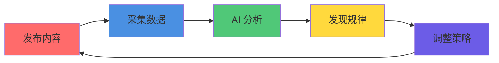

## Content Creation Services

我们为你提供三类核心服务：

### 服务 1：AI 技术文章

**你得到什么**：
- 深度技术教程（如：Claude 使用指南、向量数据库实战）
- 工具评测对比（如：5 款 AI 编程助手对比）
- 技术趋势分析（如：2026 AI 大模型趋势）
- 最佳实践总结（如：AI 内容生产最佳实践）

**内容标准**：

| 维度 | 标准 | 说明 |
|------|------|------|
| 字数 | 800-2000 字 | 根据主题深度调整 |
| 结构 | 标题 + 引言 + 正文 + 总结 | 清晰的逻辑结构 |
| 配图 | 2-4 张 | 图文相关度 ≥ 80% |
| 原创 | 100% | 查重 < 5% |
| 可读性 | ≥ 4.0/5.0 | AI 评分 |

**服务流程**：

```
1. 你提供主题方向或让我们推荐
2. AI 深度调研（30 分钟）
3. AI 生成初稿（15 分钟）
4. 5 次质量检查（10 分钟）
5. 交付给你审核
6. 根据反馈修改（最多 3 轮）
7. 最终交付
```

**交付时间**：24 小时内

**输出格式**：Markdown + 配图

---

### 服务 2：行业分析报告

**你得到什么**：
- 一人公司案例研究（如：Notion 如何从濒临倒闭到 $10B）
- 行业深度调研（如：AI 编程工具市场分析）
- 竞品对比分析（如：Claude vs GPT-4 全面对比）
- 趋势预测报告（如：2026 AI 领域机会点）

**内容标准**：

| 维度 | 标准 | 说明 |
|------|------|------|
| 字数 | 3000-8000 字 | 深度调研 |
| 数据 | ≥ 10 个数据点 | 真实数据支撑 |
| 来源 | ≥ 5 个来源 | 官网、新闻、财报等 |
| 结构 | 背景 + 分析 + 洞察 + 建议 | 完整分析框架 |
| 原创 | 100% | 独家洞察 |

**服务流程**：

```
1. 你指定研究对象或让我们推荐
2. AI 筛选标准（营收、团队、运营时间等）
3. AI 多维度调研（2-4 小时）
4. AI 提炼洞察和模式
5. AI 撰写深度报告
6. 质量检查
7. 交付给你审核
8. 根据反馈修改
9. 最终交付
```

**交付时间**：48 小时内

**输出格式**：Markdown + 数据图表 + 可视化

**已有案例**：

| 研究对象 | 年营收 | 核心洞察 |
|----------|--------|----------|
| Notion | $1.2B ARR | 从"all-in-one"到"可组合工具集"的战略转型 |
| Grammarly | $500M ARR | 16 年长期主义，极致产品体验 |
| Figma | $400M ARR | 年轻人颠覆传统，基于浏览器的协作设计 |
| ElevenLabs | $330M ARR | 创作者市场飞轮，先工具后平台 |
| Runway | $300M ARR | 技术 + 产品双驱动，Gen-2 的突破 |

---

### 服务 3：教程与工具推荐

**你得到什么**：
- AI 工具使用教程（如：如何用 Claude 提升工作效率）
- 工具推荐清单（如：10 个必用的 AI 开发工具）
- 效率提升指南（如：AI 办公自动化完全指南）
- 学习路径规划（如：从 0 到 1 学习 AI 编程）

**内容标准**：

| 维度 | 标准 | 说明 |
|------|------|------|
| 字数 | 1000-2000 字 | 实用为主 |
| 截图 | ≥ 3 张 | 操作步骤截图 |
| 步骤 | 清晰可复现 | 用户能跟着做 |
| 工具 | 真实可用 | 不推荐付费墙内的工具 |

**服务流程**：

```
1. 你指定工具或场景
2. AI 实际操作验证
3. AI 撰写教程 + 截图
4. 质量检查（特别是可复现性）
5. 交付
```

**交付时间**：24 小时内

---

## Research Services

### 服务 1：一人公司案例研究

**你得到什么**：
- 系统化的成功案例研究
- 可复制的成功模式
- 战略建议和启示

**研究维度**：

| 维度 | 内容 | 数据来源 |
|------|------|----------|
| 商业模式 | 如何赚钱、增长路径 | 官网、财报、新闻 |
| 技术栈 | 使用什么技术、为什么 | 官网博客、技术分享 |
| 增长策略 | 如何获客、如何留存 | 用户访谈、数据分析 |
| 团队管理 | 如何组织、如何协作 | 公开访谈、博客 |
| 成功要素 | 关键决策、重要转折点 | 深度分析 |

**输出格式**：
- Markdown 报告（3000-8000 字）
- 数据可视化图表
- 关键洞察总结
- 可复制模式提炼

**已有成果**：
- 21 份深度报告（180,000+ 字）
- 覆盖 25 家 AI 企业
- 提炼 3 种可复制模式

---

### 服务 2：AI 行业调研

**你得到什么**：
- 特定领域/赛道的深度调研
- 市场规模、竞争格局、趋势预测
- 机会点识别

**调研框架**：

```
1. 市场规模
   - 当前规模
   - 增长速度
   - 未来预测

2. 竞争格局
   - 主要玩家
   - 市场份额
   - 差异化策略

3. 用户需求
   - 目标用户
   - 核心痛点
   - 支付意愿

4. 技术趋势
   - 当前技术
   - 未来方向
   - 技术壁垒

5. 机会点
   - 未被满足的需求
   - 技术突破点
   - 商业模式创新
```

**交付时间**：1 周

---

### 服务 3：竞品分析

**你得到什么**：
- 指定竞品的深度分析
- SWOT 分析
- 差异化策略建议

**分析维度**：

| 维度 | 内容 |
|------|------|
| 产品功能 | 核心功能、特色功能、缺失功能 |
| 用户体验 | 易用性、美观度、流畅度 |
| 技术架构 | 技术栈、架构设计、技术优势 |
| 商业模式 | 盈利模式、定价策略、获客渠道 |
| 市场表现 | 用户量、增长率、口碑 |
| 你的机会 | 竞品弱点、你的优势、差异化方向 |

**交付时间**：3 天

---

## Operational Support

### 服务 1：内容发布管理

**你得到什么**：
- 多平台自动发布（小红书、知乎、公众号、B站）
- 发布时间优化
- 格式自动适配

**支持平台**：

| 平台 | 内容类型 | 自动化程度 |
|------|----------|------------|
| 小红书 | 图文笔记 | 自动发布 |
| 知乎 | 文章 | 自动发布 |
| 微信公众号 | 图文 | 自动发布 |
| B站 | 视频（需你提供视频） | 自动上传 |
| 微博 | 图文 | 自动发布 |

**发布策略**：
- AI 分析最佳发布时间
- AI 优化标题和标签
- AI 适配不同平台格式

---

### 服务 2：数据分析

**你得到什么**：
- 自动采集 6 维数据
- AI 分析数据，发现规律
- 优化建议

**数据维度**：

| 数据 | 采集频率 | 分析内容 |
|------|----------|----------|
| 阅读量 | 每小时 | 内容表现、用户兴趣 |
| 点赞量 | 每小时 | 内容质量 |
| 收藏量 | 每小时 | 内容价值 |
| 转发量 | 每小时 | 内容传播 |
| 评论量 | 每小时 | 用户互动 |
| 互动率 | 实时计算 | 综合表现 |

**分析报告**：
- 每周数据周报
- 每月数据月报
- 优化建议

---

### 服务 3：持续优化

**你得到什么**：
- 基于数据的策略调整
- A/B 测试
- 持续改进

**优化循环**：



**优化案例**：

| 发现 | 调整 | 效果 |
|------|------|------|
| 周二 20:00 互动率高 35% | 重要内容优先周二 20:00 发布 | 整体互动率提升 20% |
| 带案例内容收藏率高 50% | 增加案例比重 | 收藏率提升 15% |
| 15-20 字标题点击率最高 | 标题控制在 15-20 字 | 点击率提升 10% |