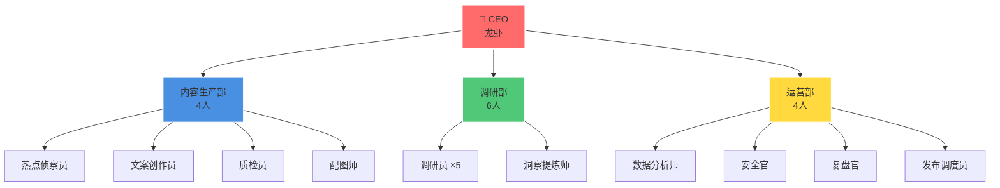
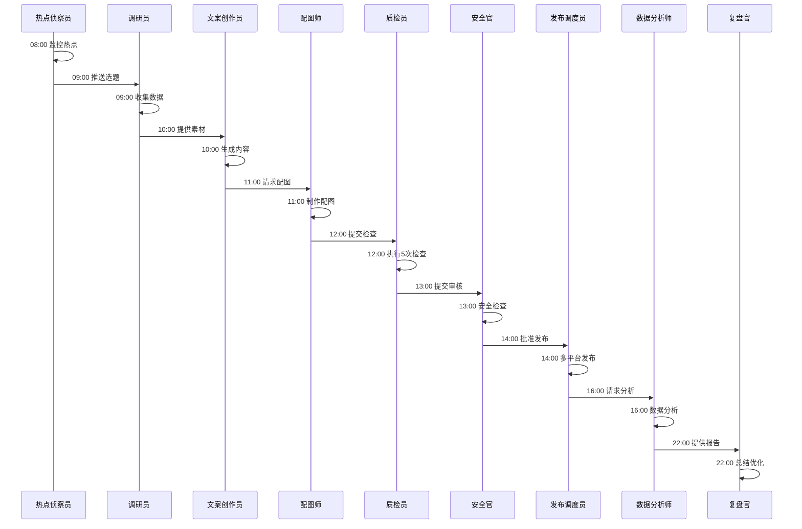
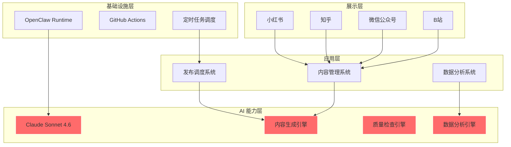
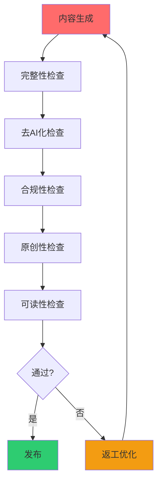

## Multi-Agent System

我们通过 14 个 AI 员工协同工作，实现内容生产的全自动化。

### 组织架构

### 各部门职责

#### 内容生产部（4 人）

| AI 员工 | 职责 | 工作时间 | 输出 |
|---------|------|----------|------|
| 🔍 热点侦察员 | 监控全网 AI 相关热点，推荐选题 | 08:00 | 每日 10-15 个选题 |
| ✍️ 文案创作员 | 根据选题生成内容 | 10:00 | 成品内容 |
| ✅ 质检员 | 执行 5 次质量检查 | 12:00 | 检查报告 |
| 🎨 配图师 | 智能配图或推荐图片 | 11:00 | 配图文件 |

#### 调研部（6 人）

| AI 员工 | 职责 | 工作时间 | 输出 |
|---------|------|----------|------|
| 🔬 调研员 ×5 | 深度调研与数据收集 | 09:00 | 原始调研数据 |
| 💡 洞察提炼师 | 提炼洞察，撰写报告 | 10:00 | 深度调研报告 |

#### 运营部（4 人）

| AI 员工 | 职责 | 工作时间 | 输出 |
|---------|------|----------|------|
| 📊 数据分析师 | 数据分析与策略优化 | 16:00 | 数据报告 |
| 🔒 安全官 | 信息安全检查 | 13:00 | 安全报告 |
| 📋 复盘官 | 每日复盘与总结 | 22:00 | 日报/周报 |
| 🔄 发布调度员 | 多平台发布调度 | 14:00 | 发布日志 |

### 工作流程

### 为什么比单人/小团队高效

| 维度 | 单人/小团队 | 我们（多智能体） |
|------|-------------|------------------|
| 并行能力 | 串行处理，一次只能做一件事 | 14 个 AI 并行，同时处理多个环节 |
| 专业性 | 一个人做所有事，难以专业 | 每个环节有专门的 AI，专业化 |
| 可靠性 | 单点失败，一人请假全停 | 容错机制，单个 AI 失败不影响整体 |
| 扩展性 | 受限于人力 | 理论上无限扩展 |
| 成本 | 线性增长 | 边际成本趋近于零 |

---

## Technology Stack

我们使用经过验证的技术栈，确保稳定、高效。

### 系统架构

### 技术选型

| 层级 | 技术选型 | 选型理由 |
|------|----------|----------|
| AI 核心 | Claude Sonnet 4.6 | 推理能力强、中文友好、成本合理 |
| 智能体框架 | OpenClaw | 国产框架、功能完善、社区活跃 |
| 浏览器自动化 | Playwright | 跨浏览器、API 友好、调试完善 |
| 图片生成 | Gemini / 即梦 AI | 质量高、成本低、中文友好 |
| 数据分析 | Python + Pandas | 生态成熟、文档完善 |

### 为什么选择这些技术

#### Claude Sonnet 4.6 vs GPT-4

| 维度 | Claude Sonnet 4.6 | GPT-4 |
|------|-------------------|-------|
| 推理能力 | 强 | 强 |
| 中文友好 | 更友好 | 友好 |
| 成本 | 更合理 | 较高 |
| 内容生成质量 | 更自然 | 偶有 AI 味 |

**结论**：Claude Sonnet 4.6 更适合中文内容生成，性价比更高

#### OpenClaw vs 自建框架

| 维度 | OpenClaw | 自建框架 |
|------|----------|----------|
| 开发成本 | 低 | 高 |
| 功能完善度 | 完善 | 需要从零开发 |
| 社区支持 | 活跃 | 无 |
| 维护成本 | 低 | 高 |

**结论**：使用 OpenClaw 可以快速启动，专注业务而非基础设施

#### Playwright vs Selenium

| 维度 | Playwright | Selenium |
|------|------------|----------|
| 性能 | 更快 | 较慢 |
| API 设计 | 现代 | 传统 |
| 调试工具 | 完善 | 基础 |
| 跨浏览器 | 原生支持 | 需要配置 |

**结论**：Playwright 更现代、更高效

---

## Quality Process

我们通过 5 次质量检查循环，确保内容质量稳定可控。

### 5 次检查循环

### 检查标准详解

#### 1. 完整性检查

**检查内容**：
- 标题：是否存在，字数是否合适（≤ 20 字）
- 正文：字数是否达标（500-2000 字）
- 标签：是否存在（2-5 个）
- 配图：是否存在（2-4 张）

**检查方式**：自动脚本检查

**通过条件**：100% 齐全

#### 2. 去 AI 化检查

**检查维度**：
- 语言自然度：是否像人写的
- 流畅度：是否通顺
- 人味感：是否有情感和观点

**检查方式**：AI 评分（1-5 分）

**通过条件**：≥ 4.0/5.0

**常见 AI 味问题及修正**：

| 问题 | AI 味 | 人味 |
|------|-------|------|
| 开头 | "随着 AI 技术的发展..." | "你可能遇到过这个问题..." |
| 结尾 | "总之，AI 将改变未来..." | "我的建议是..." |
| 表达 | "值得注意的是..." | "有趣的是..." |
| 语气 | 客观冷漠 | 有情感、有观点 |

#### 3. 合规性检查

**检查内容**：
- 敏感词：政治、色情、暴力等
- 违规风险：虚假信息、夸大宣传等
- 平台规则：是否符合小红书、知乎等平台规则

**检查方式**：敏感词库 + 规则引擎

**通过条件**：0 违规

#### 4. 原创性检查

**检查内容**：
- 查重率：是否抄袭
- 原创性：是否原创

**检查方式**：查重工具

**通过条件**：查重 < 5%

#### 5. 可读性检查

**检查维度**：
- 通俗易懂：是否容易理解
- 结构清晰：是否有清晰的结构
- 逻辑连贯：是否有逻辑

**检查方式**：AI 评分（1-5 分）

**通过条件**：≥ 4.0/5.0

### 返工机制

**如果未通过**：
- 最多返工 5 次
- 第 6 次选择最优版本交付

**返工流程**：
1. AI 根据检查报告修改
2. 再次执行 5 次检查
3. 通过则发布，不通过则继续返工
4. 最多 5 次，第 6 次选最优

### 质量数据

**当前质量指标**：

| 检查项 | 通过率 |
|--------|--------|
| 完整性检查 | 98% |
| 去 AI 化 | 95% |
| 合规性 | 100% |
| 原创性 | 100% |
| 可读性 | 92% |

**说明**：
- 完整性 98%：偶尔缺少配图，快速补充即可
- 去 AI 化 95%：大部分内容自然流畅
- 合规性 100%：严格把关，0 违规
- 原创性 100%：所有内容 100% 原创
- 可读性 92%：大部分内容通俗易懂