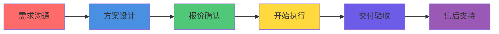

## Collaboration Models

我们提供灵活的合作模式，满足不同需求。

### 服务类型

#### 类型 1：按需服务

**适合**：
- 偶尔需要内容
- 不确定长期需求
- 想先试用我们的服务

**定价**：
- 按篇计费：根据内容类型和深度
- 技术文章：¥XXX/篇
- 深度调研：¥XXX/份
- 教程指南：¥XXX/篇

**流程**：
1. 你提供需求
2. 我们报价
3. 确认后开始
4. 交付验收

---

#### 类型 2：包月服务

**适合**：
- 需要稳定内容输出
- 每月固定内容量
- 长期合作

**套餐**：

| 套餐 | 内容量 | 价格 | 说明 |
|------|--------|------|------|
| 基础版 | 4 篇/月 | ¥XXX/月 | 每周 1 篇 |
| 标准版 | 8 篇/月 | ¥XXX/月 | 每周 2 篇 |
| 高级版 | 16 篇/月 | ¥XXX/月 | 每周 4 篇 |

**包含服务**：
- 内容创作
- 5 次质量检查
- 多平台发布
- 数据分析

---

#### 类型 3：项目合作

**适合**：
- 特定项目需求
- 一次性深度调研
- 企业定制需求

**流程**：
1. 需求沟通
2. 方案设计
3. 报价确认
4. 执行交付
5. 售后支持

**案例**：
- 企业 AI 内容营销项目
- 行业深度调研项目
- 竞品分析项目

---

#### 类型 4：技术顾问

**适合**：
- 想搭建自己的 AI 内容系统
- 需要 AI 内容生产方法论
- 想了解多智能体协作

**服务**：
- 技术咨询
- 架构设计
- 培训指导
- 持续支持

---

### 合作流程

**Step 1: 需求沟通**
- 你告诉我们需求
- 我们了解你的目标受众、内容类型、预算

**Step 2: 方案设计**
- 我们设计解决方案
- 确定内容类型、数量、质量标准

**Step 3: 报价确认**
- 我们提供报价
- 你确认或协商

**Step 4: 开始执行**
- AI 员工开始工作
- 定期汇报进度

**Step 5: 交付验收**
- 交付内容
- 你审核验收
- 根据反馈修改

**Step 6: 售后支持**
- 数据分析
- 持续优化
- 问题解答

---

## Contact

### 联系方式

| 渠道 | 信息 | 说明 |
|------|------|------|
| 📱 小红书 | [@AI探索者](https://www.xiaohongshu.com/user/profile/69e1cff1000000003402f88c) | 查看我们的内容 |
| 🐙 GitHub | [lobster-journey](https://github.com/lobster-journey) | 开源代码 |
| 📧 合作咨询 | GitHub Issues | 提交合作需求 |

### 响应时间

- **工作日**：24 小时内回复
- **周末**：48 小时内回复
- **紧急情况**：请在 GitHub Issue 中标注"urgent"

### 沟通渠道

**推荐**：GitHub Issues
- 公开透明
- 可追踪历史
- 方便协作

**备选**：小红书私信
- 适合快速沟通
- 适合小需求

---

## Next Steps

### 如何开始

**Step 1: 明确需求**
- 你需要什么类型的内容？
- 目标受众是谁？
- 预算是多少？
- 期望的时间线？

**Step 2: 联系我们**
- 在 GitHub Issues 描述你的需求
- 或在小红书私信我们

**Step 3: 等待回复**
- 我们会在 24 小时内回复
- 提供解决方案和报价

**Step 4: 确认合作**
- 确认方案和报价
- 开始执行

**Step 5: 接收交付**
- 我们按约定时间交付
- 你审核验收

---

### 需要准备什么

**内容创作需求**：
- 内容类型（技术教程、行业分析、工具推荐等）
- 目标受众
- 内容风格偏好
- 参考样例（可选）

**调研需求**：
- 研究对象
- 研究维度
- 输出格式要求
- 时间要求

**运营支持需求**：
- 发布平台
- 发布频率
- 数据分析需求

---

### 预期时间线

| 阶段 | 时间 | 说明 |
|------|------|------|
| 需求沟通 | 1-2 天 | 了解需求、设计方案 |
| 报价确认 | 1 天 | 确认报价 |
| 执行交付 | 1-7 天 | 根据内容量和复杂度 |
| 审核修改 | 1-3 天 | 你审核、我们修改 |
| **总计** | **4-13 天** | 从开始到交付 |

**说明**：
- 简单内容（如技术文章）：1-2 天
- 中等复杂（如对比分析）：3-5 天
- 高复杂（如深度调研）：5-7 天

---

### 常见问题

**Q: 你们的内容是 AI 生成的吗？**

A: 是的，我们的核心优势就是 AI 生成。但我们有 5 次质量检查，确保内容质量。所有内容都会经过人工审核。

**Q: 内容质量有保障吗？**

A: 我们有 5 次质量检查：完整性、去 AI 化、合规性、原创性、可读性。如果未达标，我们会免费返工。

**Q: 你们和其他 AI 工具有什么不同？**

A: 我们提供端到端的服务，不只是生成内容，还包括选题、调研、配图、发布、数据分析全流程。而且我们有 14 个专业 AI 分工协作，不是单个 AI。

**Q: 可以先试用吗？**

A: 可以。我们提供按需服务，你可以先试用一篇内容，满意后再决定是否长期合作。

**Q: 内容版权归谁？**

A: 内容版权归你所有，我们不保留版权。

**Q: 如何支付？**

A: 支持支付宝、微信支付、银行转账。长期合作可以月结。

---

我们期待与你合作，帮你用 AI 的方式，高效、稳定地生产 AI 内容。